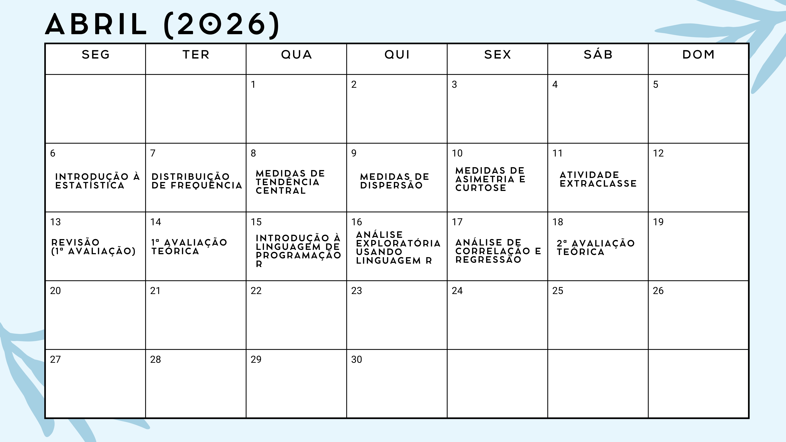
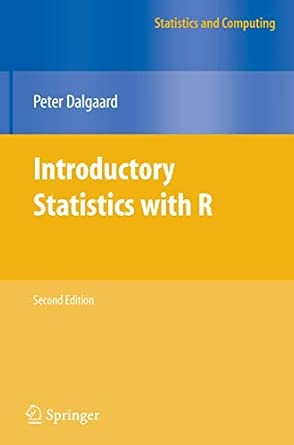
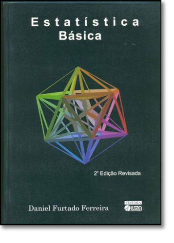
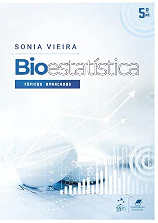
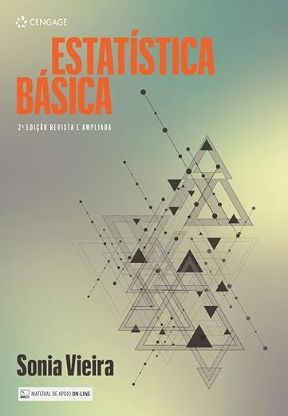

class: title-slide, center, middle
background-image: url(fig/slide-title/LMFTCA.png), url(fig/slide-title/ufpa.png), url(fig/slide-title/capa2.png)
background-position: 90% 90%, 10% 90%
background-size: 150px, 150px, cover

```{r setup, include=FALSE}
knitr::opts_chunk$set(
  fig.showtext = TRUE,
  fig.align = "center", 
  cache = TRUE,
  error = FALSE,
  message = FALSE, 
  warning = FALSE, 
  collapse = TRUE ,
  dpi = 600)
```

```{r xaringan-logo, echo=FALSE}
library(xaringanExtra)
use_logo(
  image_url = "fig/slide-title/ufpa.png",
  position = css_position(top = ".8em", right = "-.5em"),
  width = "140px",
  height = "140px"
)
```

```{r icon, echo=FALSE}
#remotes::install_github("mitchelloharawild/icons")
#library(icons)
#download_fontawesome()
#download_simple_icons()
```

```{r, echo=FALSE}
#remotes::install_github("jhelvy/xaringanBuilder")
#library(xaringanBuilder)
#build_pdf("Aula0-Cronograma.Rmd")
#pagedown::chrome_print("Slides/Aula0-Cronograma.html",output="test.pdf")
```

<!-- title-slide -->
### Estatística Básica <br> (FL03017-EB)

## ᨒ <br>   `r anicon::faa("pagelines", animate="horizontal", colour="green")` Programação da Disciplina `r anicon::faa("pagelines", animate="horizontal", colour="green")` <br> ᨒ

##### 〰〰〰〰〰〰🌱〰〰〰〰〰〰
##### ᨒ
##### .font120[**Prof. Dr. Deivison Venicio Souza**]
##### Universidade Federal do Pará (UFPA)
##### Faculdade de Engenharia Florestal
##### Laboratório de Manejo Florestal, Tecnologias e Comunidades Amazônicas
##### E-mail: deivisonvs@ufpa.br
<br>
##### 1ª versão: 06/abril/2021 <br> (Atualizado em: `r format(Sys.Date(),"%d/%B/%Y")`) <br> Altamira, Pará

---
layout: true
class: with-logo logo-ufpa
<div class="my-header"></div>
<div class="my-footer"><span>Prof. Dr. Deivison Venicio Souza (E-mail: deivisonvs@ufpa.br)&emsp;&emsp;&emsp;&emsp;&emsp; <div3>Estatística Básica (FL03017-EB)</div3>/ <div2>Programação e Orientações</div2> </div>

---

## 👋 Olá, sejam bem vindos!

### 🎓 **Sobre o facilitador**

.pull-left-9[
.font70[
1. .blue[Graduação (Titulação: ano 2008)]
    - Universidade Federal Rural da Amazônia (UFRA); e
    - Título: Bacharel em Engenharia Florestal.
    
2. .blue[Mestrado (Titulação: ano 2011)]
    - Universidade Federal Rural da Amazônia (UFRA);
    - Programa de Pós-graduação em Ciências Florestais (PPGCF); e
    - Área de Concentração: Manejo de Ecossistemas Florestais.

3. .blue[Especialização (Titulação: ano 2019)]
    - Universidade Federal do Paraná (UFPR);
    - Área: Big Data e Data Science
    
4. .blue[Doutorado (Titulação: ano 2020)]
    - Universidade Federal do Paraná (UFPR);
    - Programa de Pós-graduação em Engenharia Florestal (PPGEF); e
    - Área de Concentração: Manejo Florestal.
]
]

.pull-right-9[
```{r echo = FALSE, out.width='60%', fig.align='center', fig.cap='', dpi=600}

```
]

---

## 👋 Olá, sejam bem vindos!

### 🚀 **Interesses atuais**

.pull-left-9[
.font70[
1. .blue[Linguagem de programação]
    - R
    - Python

2. .blue[Modelagem preditiva aplicada à ciência florestal]
    - Métodos Tradicionais e Aprendizado de máquina
    
3. .blue[Visão computacional e Inteligência Artificial]
    - Reconhecimento de espécies baseado em imagens (aéreas e terrestres)
    - Deep Learning/Convolutional Neural Networks/Transfer Learning
    - Estimativa de biomassa e carbono
    - Monitoramento da saúde da arborização urbana
    
4. .blue[Sistemas Interativos de Visualização e Análise de Dados]
    - Dashboard (Estático e Dinâmico)
    - Aplicação Web (Reconhecimento de espécies)
    - Aplicativo Mobile (Próximos passos...)
]
]

.pull-right-9[
### 📲 **Websites e contatos**

.font80[
`r icons::simple_icons("github")` GitHub: https://github.com/DeivisonSouza

<span class="iconify" data-icon="fa-brands:orcid" data-inline="false"></span>


<div itemscope itemtype="https://schema.org/Person"><a itemprop="sameAs" content="https://orcid.org/0000-0002-2975-0927" href="https://orcid.org/0000-0002-2975-0927" target="orcid.widget" rel="me noopener noreferrer" style="vertical-align:top;">https://orcid.org/0000-0002-2975-0927</a></div>

```{r, echo=FALSE, out.width='40%', fig.align='center', fig.cap=''}

```
]
]

---

## 👋 Olá, sejam bem vindos!
<br>

### 🕵 **Projetos de Pesquisa/Extensão Finalizados** (com fomento)

.font80[
<br>
✔️ 1) Sistema de Visão Computacional para Reconhecer Espécies no Manejo Florestal Madeireiro na Amazônia Brasileira. (**Financiador**: Centro de Indústrias Produtoras e Exportadoras de Madeira do Estado de Mato Grosso - CIPEM) - ([https://cipem.org.br/](https://cipem.org.br/))
<br><br>

✔️ 2) Projeto Ipa’wã (Copaíba): Etnomapeamento e inventário de copaibais nativos na TI Xipaya (Aldeias Tukamã, Tukayá e Kaarimã). (**Financiador**: Fundo Brasileiro para a Biodiversidade - FUNBIO) - ([https://www.funbio.org.br/](https://www.funbio.org.br/)) (Parceria entre Associação Indígena Pyjahyry Xipaia – AIPHX e UFPA)
]

---

## 👋 Olá, sejam bem vindos!
<br>

### 🕵 **Projetos de Pesquisa/Extensão em Andamento** (com/sem fomento)

.font80[
<br>
✔️ 1) DeepWood: Reconhecimento de Espécies Florestais Baseado em Imagens de Madeira e Aprendizado Profundo (Portaria/UFPA N. 130/2024). (**Sem Financiador**) - (**Parceria**: Laboratório de Anatomia e Qualidade da Madeira LANAQM/UFPR e LMFTCA/UFPA)
<br><br>

✔️ 2) Apoio ao Fortalecimento da Gestão Territorial e Ambiental da Terra Indígena Xipaya (TI Xipaya) - (Portaria/UFPA N. 95/2025). (**Financiador**: Indigenous Peoples Assistance Facility - IPAF) (**Parceria**: Associação Indígena Pyjahyry Xipaia e LMFTCA/UFPA) - **Proponente**: AIPHX
]

---

## 👋 Olá, sejam bem vindos!
<br>

### 💻 **Siga nossas redes sociais e de parceiros...**
<br>

👉 **Laboratório de Manejo Florestal, Tecnologias e Comunidades Amazônicas - LMFTCA**

✔️ Instagram LMFTCA: [@lmftca_ufpa](https://www.instagram.com/lmftca_ufpa/)

✔️ Site do LMFTCA:
[https://www.lmftca.com.br/](https://www.lmftca.com.br/)
<br><br>

👉 **Instituto Juma**

✔️ Instagram IJ: [@instituto.juma](https://www.instagram.com/instituto.juma/)

✔️ Site do IJ:
[https://institutojuma.org/](https://institutojuma.org/)

---

## 📚 Ementa da disciplina (FL03017-EB)
<br>
.shadow4[
.font90[
1 - Introdução à estatística básica; 

2 - Distibuição de frequências;

3 - Medidas de tendência central (ou posição); 

4 - Medidas de dispersão (ou variabilidade); 

5 - Medidas de assimetria e curtose;

6 - Testes de comparação de médias;

7 - Análise de correlação linear simples;

8 - Análise de regressão linear simples e múltipla; e

9 - Introdução à linguagem R para análise de dados.

]
]

<!-- Slide 7 -->
---
## 📅 Cronograma .black[.font80[.brand-purple[(Horário: 07h30min - 12h30min)]]]
<br>

```{r, echo = FALSE, out.width='70%', fig.align='center', fig.cap='', dpi=600}

```

<!-- Slide 7 -->
---

## 👨🏻‍🏫 Estratégias e Ferramentas de Ensino
<br>

.font70[

👉 **Aulas expositivas** (*Sala de Aula*)

Aulas teóricas e práticas presenciais, realização de atividades complementares e avaliações de aprendizado.

<br>

👉 **Aulas práticas (sala e/ou campo)**

Aula prática de análise de IF-100% em Excel para fins de Projetos de Manejo Florestal Sustentável - PMFS (Usando dados reais). Práticas de instalação e medição de parcelas amostrais em povoamentos florestais. 

<br>

👉 **Turma virtual** (*SIGAA*)

Comunicação, envio de atividades complementares e de conteúdos digitas.

<br>

👉 **Repositório GitHub**

Repositório com os slides em .html, arquivos .R e .Rmd, figuras, conjunto de dados (e outros). O repositório pode ser acessado em: [FL03017-EB](https://github.com/DeivisonSouza/FL03017-Estatistica-Basica)
]

<!-- Slide 9 -->
---

## ✍ Estratégias de avaliação da aprendizagem

.font80[

<br>

👉 **Atividades práticas**

Exercícios com dados reais (quando possível) para aprendizado de cálculo de estatísticas amostrais manuais, em excel e linguagem R.

<br>

👉 **Avaliações teóricas**

Avaliações teóricas presenciais.

<br>

👉 **Participação e Engajamento** 

`r anicon::faa("exclamation-triangle", colour="red")` O nível de participação e interação nas aulas presenciais poderá ser critério para definir uma pontuação extra nas avaliações teóricas.
]

<!-- Slide 9 -->
---

## 📝 Média Final
<br>

\begin{equation*}
\large
MF = \frac{(NA*2)+NPT}{3}
\end{equation*}

.font80[
**MF** = Média Final

**NA** = Nota das Atividade (Soma das atividades será 10 pts.)

**NP** = Nota das Provas Teóricas (Soma das provas será 10 pts.)

<br>

| Conceito     | Intervalo      |
|--------------|----------------|
| Excelente    | 9,0 ≤ MF ≤ 10    |
| Bom          | 7,0 ≤ MF ≤ 8,9   |
| Regular      | 5,0 ≤ MF ≤ 6,9 |
| Insuficiente | 0 ≤ MF ≤ 4,9   |
]

<!-- Slide 10 -->
---
## 📑 Plano de Ensino
<br><br>

O plano de ensino da disciplina pode ser acessado em:

[Plano de Ensino (FL03017-EB)](https://github.com/DeivisonSouza/FL03017-EB/blob/master/Slides/PE/EB-PE.pdf)

<!-- Slide 11 -->
---

## 🙌 Dos critérios de aprovação `r anicon::faa("exclamation-triangle", colour="red")`
<br>

.font80[
Conforme o **Regimento Geral da UFPA**, será considerado reprovado o discente que:

- Obtiver o conceito Insuficiente (INS), isto é, nota inferior a 5 (cinco); (.green[**Aplicável**])
- Sem Avaliação (SA); ou (.green[**Aplicável**])
- Não obtiver a frequência mínima de 75% na disciplina, isto é, Sem Frequência (SF). (.green[**Aplicável**])
]

---

## 📋 Controle de Frequência – Combinado da Turma
<br>

.font80[
🧑‍🏫 Para melhor organização e acompanhamento da presença, adotaremos o seguinte esquema de chamada de frequências:
]

--
<br>
.font80[
⏰ **1ª Chamada – Início da Aula**

🟡 Número de faltas atribuídas: **1** (Se chegar após a chamada)

📌 Objetivo: verificar presença inicial dos discentes (**Importante chegar no horário!**)
]
<br>

--

.font80[
☕ **2ª Chamada – Após o Intervalo**

🟡 Número de faltas atribuídas: **1** (Se chegar após a chamada)

📌 Objetivo: Não atrasar/atrapalhar o reinício da aula
]
<br>

--

.font80[
🏁 **3ª Chamada – Final da Aula**

🟡 Número de faltas atribuídas: **1** (Se não estiver presente no final da aula)

📌 Objetivo: confirmar participação até o final

<br>
 
🙌 **Organização, compromisso e participação fazem a diferença!**
]

<!-- Slide 12 -->
---

## 📜 Normativas
<br>

.font80[
- [Regimento geral da UFPA de 29/12/2006](chrome-extension://efaidnbmnnnibpcajpcglclefindmkaj/https://www.ufpa.br/images/docs/regimento_geral.pdf)

Disciplina os aspectos gerais e comuns da estruturação e do funcionamento dos órgãos e serviços da Universidade Federal do Pará (UFPA), cujo Estatuto regulamenta. 

- [Resolução n. 4.399, de 14 de maio de 2013](chrome-extension://efaidnbmnnnibpcajpcglclefindmkaj/http://www.proeg.ufpa.br/images/Artigos/Academico/Downloads/Regulamento_de_Graduacao.pdf)

Aprova o Regulamento do Ensino de Graduação da Universidade Federal do Pará.


- [Resolução n. 5.986, de 15 de outubro de 2025](chrome-extension://efaidnbmnnnibpcajpcglclefindmkaj/https://sege.ufpa.br/boletim_interno/downloads/resolucoes/consepe/2025/5986%20Aprova%20o%20Calend%C3%A1rio%20Acad%C3%AAmico%20da%20UFPA%20-%202026.pdf)

Aprova o Calendário Acadêmico da Universidade Federal do Pará (UFPA) para o ano de 2026.
]

<!-- Slide 13 -->
---

## 📖 Bibliografia básica

<br>

.pull-left-4[

DALGAARD, P. **Introductory statistics with R**. Springer Science & Business Media, 2008, 364p.
<br><br>

**Link**: <a href="https://www.amazon.com.br/Introductory-Statistics-R-Peter-Dalgaard/dp/0387790535/ref=sr_1_1?__mk_pt_BR=%C3%85M%C3%85%C5%BD%C3%95%C3%91&dib=eyJ2IjoiMSJ9.ladX2dQx7o4heUJ4QBSCG-P5te2amh27I0eUcVBF7LjAhb4DEgYcrDFtE-iWeVmx_qNGuDR9sC4lS-7-ib-kN_Ngwer_pAqdevh8LDQO8m8TUgUMu2-WDyuW0i7m_eP-tPxom9f7DlX5lTRygLHZYmEEVmggga_YXvfqFvg8dYTEarMV15A2PvzZceT8h1ghatLZWWXijZvBnoSNLVfbFYyKTpVW-08lahI1vJWqS3A.E-ozpIfDoosRasTQzL8a3L3huLqX9S-jwkV_g1HV2aE&dib_tag=se&keywords=Introductory+statistics+with+R&qid=1775397932&s=books&sr=1-1&ufe=app_do%3Aamzn1.fos.fcd6d665-32ba-4479-9f21-b774e276a678#detailBullets_feature_div">Introductory statistics with R</a>

]

.pull-right-4[
```{r, echo=FALSE, out.width='50%', fig.align='center', fig.cap='', dpi=600}

```
]

---

## 📖 Bibliografia básica

<br>

.pull-left-4[

FERREIRA, D. F. Estatística básica. 2 ed. rev. Lavras: Ed. UFLA, 2009. 664 p.
<br><br>

**Link**: <a href="https://www.amazon.com.br/Estat%C3%83%C2%ADstica-B%C3%83%C2%A1sica-Daniel-Furtado-Ferreira/dp/8587692712">Estatística básica</a>

]

.pull-right-4[
```{r, echo=FALSE, out.width='60%', fig.align='center', fig.cap='', dpi=600}

```
]


---

## 📖 Bibliografia básica
<br>

.pull-left-4[
**Livro com códigos em R na internet**
<br><br>

MORETTIN, PEDRO ALBERTO; BUSSAB, WILTON OLIVEIRA. **Estatística básica**. 9 ed., São Paulo: Saraiva, 2017, 554p.
<br><br>

Dados, códigos R (e outros) podem ser acessados em:

**Link**: <a href="https://www.ime.usp.br/~pam/EstBas.html">Estatística básica</a>

]

.pull-right-4[
```{r, echo=FALSE, out.width='60%', fig.align='center', fig.cap='', dpi=600}
knitr::include_graphics('fig/slide-title/Livro-Bussab.jpeg')
```
]

---

## 📖 Bibliografia complementar

<br>

.pull-left-4[

VIEIRA, S. **Bioestatística: tópicos avançados**. 5ª ed. Rio de Janeiro: GEN Guanabara Koogan, 2023. 530p.
<br><br>

**Link**: <a href="https://www.amazon.com.br/Bioestat%C3%ADstica-T%C3%B3picos-Avan%C3%A7ados-Sonia-Vieira-ebook/dp/B0BT27DD2H/ref=sr_1_2?__mk_pt_BR=%C3%85M%C3%85%C5%BD%C3%95%C3%91&dib=eyJ2IjoiMSJ9.TIz6czrpswGmj-ofU_GT5VMlyaXkvCYRYa2wuHUcRNOqPoDVbeaFzOebYdNuDVg-o_SXxyDIRvhn5_Ko5gYHabn42KlUr7DMKuEpbIlf4iqZJREmTic3rWTXsPqkyUx4.ddh4y1TnZE2uy_wvHnIDB5SMRDIUmX0Jsy7UjQx259I&dib_tag=se&keywords=VIEIRA%2C+S.+Bioestat%C3%ADstica%3A+t%C3%B3picos+avan%C3%A7ados.+3+ed.+Rio+de+Janeiro%3A+Elsevier%2C+2010.+278p.&qid=1775398343&s=books&sr=1-2#detailBullets_feature_div">Bioestatística: tópicos avançados</a>

]

.pull-right-4[
```{r, echo=FALSE, out.width='60%', fig.align='center', fig.cap='', dpi=600}

```
]

---

## 📖 Bibliografia complementar

<br>

.pull-left-4[

VIEIRA, S. **Estatística básica**. 2ª ed. São Paulo: Cengage Learning, 2018. 272p.
<br><br>

**Link**: <a href="https://www.amazon.com.br/Estat%C3%ADstica-B%C3%A1sica-Sonia-Vieira/dp/8522128073/ref=sr_1_1?__mk_pt_BR=%C3%85M%C3%85%C5%BD%C3%95%C3%91&crid=OMEV6679V2U1&dib=eyJ2IjoiMSJ9.NtSCfYXdkMzhgRm71ek2CQ.FxAdhsC4c0rNFjYtBUHQnrmpEFqQWqAFyJ96BBXBIrg&dib_tag=se&keywords=VIEIRA%2C+S.+Estat%C3%ADstica+b%C3%A1sica.+S%C3%A3o+Paulo%3A+Cengage+Learning%2C+2012.+176p.&qid=1775398634&s=books&sprefix=vieira+s.+estat%C3%ADstica+b%C3%A1sica.+s%C3%A3o+paulo+cengage+learning+2012.+176p+%2Cstripbooks%2C367&sr=1-1">Estatística básica</a>

]

.pull-right-4[
```{r, echo=FALSE, out.width='60%', fig.align='center', fig.cap='', dpi=600}

```
]

---

layout: false
name: etim
class: inverse, middle, center
background-image: url(fig/class0/sec.png)
background-size: cover

## .font200[Obrigado!]

```{r, echo=FALSE, out.width='20%', fig.align='center', fig.cap='', dpi=600}
knitr::include_graphics('fig/slide-title/LMFTCA.png')
```

👨🏻‍👩🏻‍👦🏻‍👦🏻 [@lmftca_ufpa](https://www.instagram.com/lmftca_ufpa/)

🌎 [https://www.lmftca.com.br/](https://www.lmftca.com.br/)

