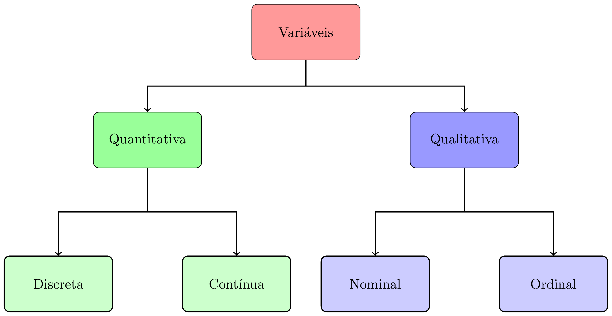

class: title-slide, center, middle
background-image: url(fig/slide-title/LMFTCA.png), url(fig/slide-title/ufpa.png), url(fig/slide-title/capa2.png)
background-position: 90% 90%, 10% 90%
background-size: 150px, 150px, cover

```{r setup, include=FALSE}
knitr::opts_chunk$set(
  fig.showtext = TRUE,
  fig.align = "center", 
  cache = FALSE,
  error = FALSE,
  message = FALSE, 
  warning = FALSE, 
  collapse = TRUE ,
  dpi = 600)
```

```{r xaringan-logo, echo=FALSE}
library(xaringanExtra)
use_logo(
  image_url = "fig/slide-title/ufpa.png",
  position = css_position(top = ".8em", right = "-.5em"),
  width = "140px",
  height = "140px"
)
```

```{r icon, echo=FALSE}
#remotes::install_github("mitchelloharawild/icons")
#library(icons)
#download_fontawesome()
#download_simple_icons()
```

```{r, echo=FALSE}
library(ggplot2)
```

<!-- title-slide -->
### Estatística Básica <br> (FL03017-EB)

## ᨒ <br>   `r anicon::faa("pagelines", animate="horizontal", colour="green")` Introdução à estatística básica `r anicon::faa("pagelines", animate="horizontal", colour="green")` <br> ᨒ

##### 〰〰〰〰〰〰🌱〰〰〰〰〰〰
##### ᨒ
##### .font120[**Prof. Dr. Deivison Venicio Souza**]
##### Universidade Federal do Pará (UFPA)
##### Faculdade de Engenharia Florestal
##### Laboratório de Manejo Florestal, Tecnologias e Comunidades Amazônicas
##### E-mail: deivisonvs@ufpa.br
<br>
##### 1ª versão: 06/abril/2021 <br> (Atualizado em: `r format(Sys.Date(),"%d/%B/%Y")`) <br> Altamira, Pará

---
layout: true
<div class="my-header"></div>
<div class="my-footer"><span>Prof. Dr. Deivison Venicio Souza (E-mail: deivisonvs@ufpa.br)&emsp;&emsp;&emsp;&emsp;&emsp;Estatística Básica (FL03017-EB) - Introdução à estatística básica</div>

---

## 📚 Ementa da disciplina (FL03017-EB)
<br>
.shadow4[
.font90[
1 - **Introdução à estatística básica**; 

2 - Distibuição de frequências;

3 - Medidas de tendência central (ou posição); 

4 - Medidas de dispersão (ou variabilidade); 

5 - Medidas de assimetria e curtose;

6 - Testes de comparação de médias;

7 - Análise de correlação linear simples;

8 - Análise de regressão linear simples e múltipla; e

9 - Introdução à linguagem R para análise de dados.

]
]

---

## Objetivos
<br><br>
Ao final desta aula espera-se que o discente seja capaz de...

* Compreender terminologias e conceitos básicos;
* Compreender a diferença ente estatística descritiva e estatística inferêncial;
* Compreender a diferença ente Amostra e População;
* Compreender a diferença ente Parâmetro e Estatística; e
* Compreender e diferenciar os tipos de variáveis.

---

## Conteúdo

.pull-left-4[
**Terminologias e conceitos básicos**

[1 - O que é estatística?](#Est)

[2 - Estatística descritiva e Estatística inferêncial](#DI)

[3 - População e Amostra](#PA)

[4 - Tipos de Variáveis](#TV)

[5 - Parâmetro x Estatística](#VP)
]

---

## Leitura complementar
<br>

.pull-left-4[
**Livro recomendado**
<br><br>

Morettin, Pedro Alberto; Bussab, Wilton Oliveira. **Estatística básica**. 9 ed., São Paulo: Saraiva, 2017, 554p.
<br><br>

**Parte 1** - Análise Exploratória de Dados (Capítulos 2 e 3).
<br><br>

Dados, códigos R (e outros) podem ser acessados em:

**Link**: <a href="https://www.ime.usp.br/~pam/EstBas.html">Estatística básica</a>

]

.pull-right-4[
```{r, echo=FALSE, out.width='60%', fig.align='center', fig.cap='', dpi=600}
knitr::include_graphics('fig/slide-title/Livro-Bussab.jpeg')
```
]

<!-- Slide XX -->
---
layout: false
name: conc
class: inverse, middle, center
background-image: url(fig/class0/sec.png)
background-size: cover

.font200[**Parte 1 <br> Terminologias e conceitos básicos**]

---
layout: true
<div class="my-header"></div>
<div class="my-footer"><span>Prof. Dr. Deivison Venicio Souza (E-mail: deivisonvs@ufpa.br)&emsp;&emsp;&emsp;&emsp;&emsp;Estatística Básica (FL03017-EB) - Introdução à Estatística Básica</div>

---

## Terminologias e conceitos básicos

<br>

.shadow3[
### Conceito

A estatística serve para ajudar na **descrição de fenômenos** e na **tomada de decisões**.
]

<br>

### Divisões da estatística

A estatística é, em geral, dividida em dois grandes grupos:

1. Estatística Descritiva
2. Estatística Inferencial

---

## Terminologias e conceitos básicos

<br>

### Estatística Descritiva

É a parte da estatística que lida com a **organização**, **resumo** e **apresentação** de dados (Ferreira, 2009)

<br>

`r anicon::faa("hand-point-right", animate="horizontal")` .blue[**Os dados podem ser resumidos de forma numérica ou gráfica.**]

---

## Terminologias e conceitos básicos
<br>

.left-column[

```{r , echo=FALSE, eval=TRUE}
library(dplyr)

data <- data.table::fread("data/Cedrela.csv")

# data %>%
#   knitr::kable(format= "html")

data |>
   DT::datatable(editable = 'cell', rownames = FALSE, style = "default",
                 class = "display", width = '350px',
                 caption = 'Dados de Cedrela odorata.',
     options=list(pageLength = 10, dom = 'tip', autoWidth = F,
       initComplete = htmlwidgets::JS(
          "function(settings, json) {",
          paste0("$(this.api().table().container()).css({'font-size': '", "12pt", "'});"),
          "}")
       ) 
     )
```
]

.right-column[

### Como extrair informações descritivas?

* Calcular medidas descritivas quantitativas.

```{r}
# Usando funções da linguagem R
mean(data$D)
sd(data$D)
var(data$H)
table(data$QF)
```

]

---

## Terminologias e conceitos básicos

.left-column[
### Como extrair informações descritivas?

* Usar representações gráficas

```{r g1_codigo, echo=TRUE, eval=FALSE}
# Criando um BoxPlot Univariado

g1 <- data |>
  ggplot(aes(x = 1, y = D)) + 
  geom_boxplot() + 
  xlab(NULL) + 
  theme_bw() +
  theme(
    axis.text.x = element_blank(),
    axis.ticks.x = element_blank()
  )

plotly::ggplotly(g1, width = 400, height = 400)
```
]


.right-column[
<br><br>

```{r g1_plot, echo=FALSE, message=FALSE, warning=FALSE, eval=TRUE}
g1 <- data |>
  ggplot(aes(x = 1, y = D)) + 
  geom_boxplot() + 
  xlab(NULL) + 
  theme_bw() +
  theme(
    axis.text.x = element_blank(),
    axis.ticks.x = element_blank()
  )

plotly::ggplotly(g1, width = 400, height = 400)
```
]


---

## Terminologias e conceitos básicos

.left-column[

### Como extrair informações descritivas?

* Usar representações gráficas

```{r g2_codigo, echo=TRUE, eval=FALSE}
# Criando um Histograma Univariado

g2 <- data |>
  ggplot(aes(x = H)) + 
  geom_histogram(
    bins = 5,
    fill = "#69b3a2",
    color = "#e9ecef",
    alpha = 0.9
  ) +
  theme_bw()

plotly::ggplotly(g2, width = 400, height = 400)
```

]

.right-column[
<br><br>
```{r g2_plot, echo=FALSE, message=FALSE, warning=FALSE}
g2 <- data |>
  ggplot(aes(x = H)) + 
  geom_histogram(
    bins = 5,
    fill = "#69b3a2",
    color = "#e9ecef",
    alpha = 0.9
  ) +
  theme_bw()

plotly::ggplotly(g2, width = 400, height = 400)
```

]

---

## Terminologias e conceitos básicos

.left-column[
### Como extrair informações descritivas?

* Usar representações gráficas

```{r g3_codigo, echo=TRUE, eval=FALSE}
# Criando um Scatterplot

g3 <- data |>
  ggplot(aes(x = D, y = V, color = QF)) +
  geom_point(size = 3) +
  theme_bw() +
  theme(legend.position = "none")

plotly::ggplotly(g3, width = 400, height = 400)
```

]

.right-column[
<br><br>
```{r g3_plot, echo=FALSE, message=FALSE, warning=FALSE}
g3 <- data |>
  ggplot(aes(x = D, y = V, color = QF)) +
  geom_point(size = 3) +
  theme_bw() +
  theme(legend.position = "none")

plotly::ggplotly(g3, width = 400, height = 400)
```

]

---

## Terminologias e conceitos básicos

<br>

### Estatística Inferencial (ou Indutiva)

É a parte da estatítica que objetiva inferir sobre uma **população** a partir da observação de uma parte dela (**amostra**).

---

## Terminologias e conceitos básicos
<br>

📊 **População x Amostra**
<br>

.font80[
**População**: A população é o **conjunto completo de elementos** que possuem a **característica** que deseja-se estudar.
<br>

👉 Na prática, pode ser:

- Todas as árvores de uma floresta
- Todos os alunos de um curso
- Todos os indivíduos de uma espécie

<br>

✔️ Características:

- Representa o todo.
- Pode ser muito grande ou até infinita.
- Geralmente difícil ou caro de medir/analisar.
]

---

## Terminologias e conceitos básicos
<br>

📊 **População x Amostra**
<br>

.font80[
**Amostra**: A amostra é um **subconjunto da população**, ou seja, uma parte representativa do todo.
<br>

👉 Exemplo:

- Medir apenas algumas árvores para estimar o volume de madeira médio da floresta
- Aplicar questionário a parte dos alunos
<br>

✔️ Características:

- Mais prática e econômica (< tempo < custo)
- Usada para fazer inferências sobre a população
- Deve ser representativa da população (sem viés)
]

---

## Terminologias e conceitos básicos
<br>

### Tipos de Variáveis

```{r, echo=FALSE, out.width='60%', fig.align='center', fig.cap='', dpi=600}

```

---

## Terminologias e conceitos básicos
<br>

### Variáveis Qualitativas (ou Categóricas)

A variável é qualitativa (ou categórica) quando seus valores são distribuídos em categorias mutuamente exclusivas (Vieira, 2018).

--
<br><br>

Estas podem ser classificadas em dois tipos: 

`r anicon::faa("hand-point-right", animate="horizontal")` 1 - Variável nominal

`r anicon::faa("hand-point-right", animate="horizontal")` 2 - Variável ordinal


---

## Terminologias e conceitos básicos
<br>

### Variáveis Qualitativas (ou Categóricas)
<br>

#### Variável Nominal

A variável é nominal quando seus valores se distribuem em categorias mutuamente exclusivas, indicadas em qualquer ordem (Vieira, 2018).

--
<br><br>
#### Variável Ordinal

A variável é ordinal quando os dados são distribuídos em categorias mutuamente exclusivas que possuem ordem (Vieira, 2018).


---

## Terminologias e conceitos básicos
<br>

### Variáveis Quantitativas (ou Numéricas)

Uma variável quantitativa (ou numérica) é expressa por números que têm significado em uma escala numérica (Vieira, 2018).

--
<br><br>
Estas podem ser classificadas em dois tipos: 

`r anicon::faa("hand-point-right", animate="horizontal")` 1 - Variável discreta

`r anicon::faa("hand-point-right", animate="horizontal")` 2 - Variável contínua

---

## Terminologias e conceitos básicos
<br>

### Variáveis Quantitativas (ou Contínuas)
<br>

#### Variável Discreta

A variável é discreta quando só pode assumir alguns valores em um dado intervalo (Vieira, 2018).

--
<br><br>
#### Variável Contínua

A variável é contínua quando pode assumir qualquer valor em um dado intervalo (Vieira, 2018).

---

## Terminologias e conceitos básicos
<br>

### Vamos praticar...

1 - Dada a tabela abaixo preencha a coluna "Tipo" e "Subtipo":

.left-column[

```{r echo=FALSE, eval=T}
df <- data.frame(
  Variável = c("Nº de Rebrotos",
        "Peso de fruto",
        "Altura da árvore",
        "Volume de madeira",
        "Grau de iluminação de copas",
        "Forma de copas",
        "Qualidade de fuste"
        ), Tipo = c(NA), Subtipo = c(NA))

df |>
   DT::datatable(editable = 'cell', rownames = FALSE, style = "default",
                 class = "display", width = '450px',
                 caption = '',
     options=list(pageLength = 10, dom = 'tip', autoWidth = F,
       initComplete = htmlwidgets::JS(
          "function(settings, json) {",
          paste0("$(this.api().table().container()).css({'font-size': '", "12pt", "'});"),
          "}")
       ) 
     )
```
]

--

.right-column[

```{r echo=FALSE, eval=T}
df <- data.frame(
  Variável = c(
    "Biomassa",
    "Mês de observação",
    "Diâmetro do coleto",
    "Nome botânico",
    "Tipos de frutos (Qto à deiscência)",
    "Diâmetro da árvore",
    "Nº de sementes germinadas"
        ), Tipo = c(NA), Subtipo = c(NA))

df |> 
   DT::datatable(editable = 'cell', rownames = FALSE, style = "default",
                 class = "display", width = '450px',
                 caption = '',
     options=list(pageLength = 10, dom = 'tip', autoWidth = F,
       initComplete = htmlwidgets::JS(
          "function(settings, json) {",
          paste0("$(this.api().table().container()).css({'font-size': '", "12pt", "'});"),
          "}")
       ) 
     )
```

]

---

## Terminologias e conceitos básicos
<br>

### Parâmetro x Estatística

.font80[
.left-column[
📊 **Parâmetro**

- Refere-se à população inteira
- Seu valor é geralmente desconhecido
- Representado por letras gregas

<br>

Exemplos:

- Média populacional → μ (mi)
- Variância populacional → σ² (sigma quadrado)
- Desvio Padrão populacional → σ (sigma)
]


.right-column[
👉 Exemplo:

- A média da altura de **todas as árvores** de uma floresta.

]
]

---

## Terminologias e conceitos básicos
<br>

### Parâmetro x Estatística

.font80[
.left-column[
📈 **Estatística**

- É um valor calculado a partir dos dados coletados de uma amostra
- Representado por letras latinas

Exemplos:

- Média amostral → x̄
- Variância amostral → s²
- Desvio padrão amostral → s
]


.right-column[
👉 Exemplo:

- A média da altura de uma **amostra de árvores** (por exemplo, 100 árvores) de uma floresta.


<br><br>

🧠 Resumindo...

👉 **Parâmetro** = valor verdadeiro da população

👉 **Estatística** = estimativa (do valor verdadeiro) obtida a partir da amostra

]
]


---

## 🌳 Exemplo aplicado à Engenharia Florestal
<br>

### 🎯 Situação prática (Inventário Florestal)
<br>

.pull-left-4[
.font80[

🌲 **Contexto**

🔹 Imagine uma área com **10.000 árvores**...

👉 Objetivo: estimar a **altura média das árvores da floresta**


<br><br>


🔍 **Estratégia de campo**

👉 Medir uma **amostra de 100 árvores**

📌 *Impraticável medir toda a população*

]
]

--

.pull-right-4[
.font80[

📈 **Resultado da amostra**

Altura média (baseada na amostra) = **24,8 m**

👉 Este valor é uma **ESTATÍSTICA (x̄)**

<br><br>

📈 **Estatística**  
→ É uma estimativa baseada na amostra  
→ x̄ = 24,8 m

]
]

---

## 🌳 Exemplo aplicado à Engenharia Florestal
<br>

### 🎯 Situação prática (Inventário Florestal)
<br>

.font80[
➡️ Mas, e o **PARÂMETRO (μ)**?

👉 É a média verdadeira da altura de **todas as árvores**...

👉 Não medimos as alturas das 10.000 árvores. Portanto, **desconhecemos a média verdadeira** (μ).

👉 Em geral, na prática as populações são extensas. Portanto, medir toda população demanda tempo e custo. Por isso, é preferível realizar amostragem e inferir para a população.

<br><br>

**Percebam: 24,8 m não é a média verdadeira das altura das árvores da floresta,
é uma estimativa (aproximação) calculada a partir dos dados da amostra (100 árvores)**...

]

---
## 📖 Referências

<br>
FERREIRA, D. F. Estatística básica. 2 ed. rev. Lavras: Ed. UFLA, 2009. 664 p.
<br>

VIEIRA, S. **Estatística básica**. 2ª ed. São Paulo: Cengage Learning, 2018. 272p.

<!--Slide XX -->
---

layout: false
name: etim
class: inverse, middle, center
background-image: url(fig/class0/sec.png)
background-size: cover

## .font200[Obrigado!]

```{r, echo=FALSE, out.width='20%', fig.align='center', fig.cap='', dpi=600}
knitr::include_graphics('fig/slide-title/LMFTCA.png')
```

👨🏻‍👩🏻‍👦🏻‍👦🏻 [@lmftca_ufpa](https://www.instagram.com/lmftca_ufpa/)

🌎 [https://www.lmftca.com.br/](https://www.lmftca.com.br/)
