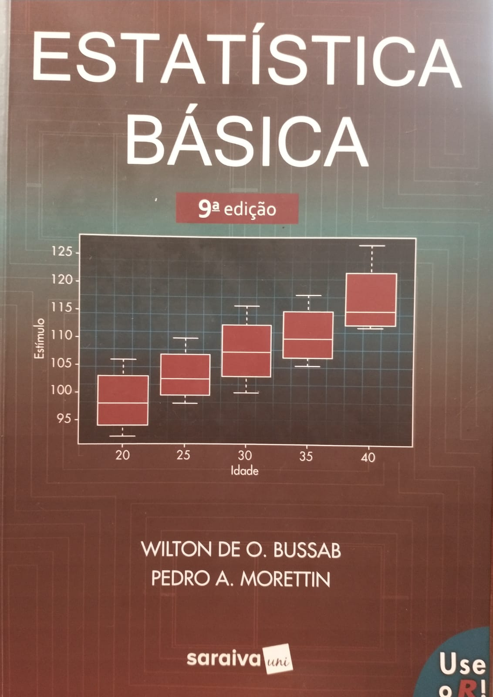
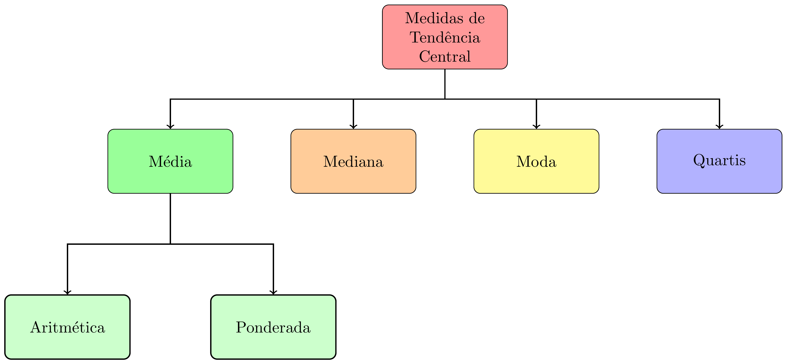
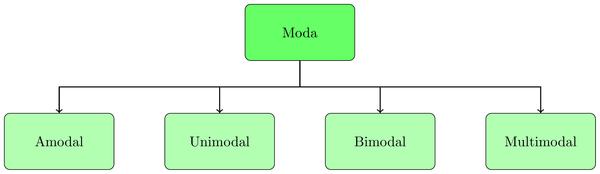

class: title-slide, center, middle
background-image: url(fig/slide-title/LMFTCA.png), url(fig/slide-title/ufpa.png), url(fig/slide-title/capa2.png)
background-position: 90% 90%, 10% 90%
background-size: 150px, 150px, cover

```{r setup, include=FALSE}
knitr::opts_chunk$set(
	error = FALSE,
	fig.align = "center",
	fig.showtext = TRUE,
	message = FALSE,
	warning = FALSE,
	cache = TRUE,
	collapse = TRUE,
	dpi = 600
)
```

```{r packages, include=FALSE}
# remotes::install_github("dill/emoGG")
library(ggplot2)
library(dplyr)
library(ggimage)
```

```{css, echo=FALSE}
.with-logo::before {
	content: '';
	width: 120px;
	height: 120px;
	position: absolute;
	bottom: 1.3em;
	right: -0.5em;
	background-size: contain;
	background-repeat: no-repeat;
}

.logo-ufpa::before {
	background-image: url(fig/slide-title/ufpa.png);
}
```

```{r xaringan-logo, echo=FALSE}
library(xaringanExtra)

use_logo(
  image_url = "fig/slide-title/LMFTCA.png",
  position = css_position(top = "1em", right = ".5em"),
  width = "130px",
  height = "130px")


use_scribble() # para escrever nos slides
use_share_again()
use_progress_bar()
#use_animate_all(style = c("slide_down"))

use_extra_styles(
  hover_code_line = TRUE,         #<<
  mute_unhighlighted_code = TRUE  #<<
)
xaringanExtra::use_editable(expires = 1)
#.can-edit[Você pode editar este título de slide]
#.can-edit.key-firstSlideTitle[Change this title and then reload the page]
use_clipboard()
```

```{r, load_refs, include=FALSE, cache=FALSE}
library(RefManageR)
BibOptions(check.entries = FALSE,
           bib.style = "authoryear",
           cite.style = "authoryear",
           style = "html",
           hyperlink = FALSE,
           dashed = FALSE)
(myBib <- ReadBib("./bib/ref.bib", check = FALSE))
```

```{r icon, echo=FALSE}
#remotes::install_github("mitchelloharawild/icons")
#remotes::install_github('emitanaka/anicon')
#library(icons)
#download_fontawesome()
#download_simple_icons()
```

<!-- title-slide -->
### Estatística Básica <br> (FL03017-EB)

## ᨒ <br>   `r anicon::faa("pagelines", animate="horizontal", colour="green")` Medidas de Tendência Central `r anicon::faa("pagelines", animate="horizontal", colour="green")` <br> ou Posição  <br> ᨒ

##### 〰〰〰〰〰〰🌱〰〰〰〰〰〰
##### ᨒ
##### .font120[**Prof. Dr. Deivison Venicio Souza**]
##### Universidade Federal do Pará (UFPA)
##### Faculdade de Engenharia Florestal
##### Laboratório de Manejo Florestal, Tecnologias e Comunidades Amazônicas
##### E-mail: deivisonvs@ufpa.br
<br>
##### 1ª versão: 06/abril/2021 <br> (Atualizado em: `r format(Sys.Date(),"%d/%B/%Y")`) <br> Altamira, Pará

---
layout: true
<div class="my-header"></div>
<div class="my-footer"><span>Prof. Dr. Deivison Venicio Souza (E-mail: deivisonvs@ufpa.br)&emsp;&emsp;&emsp;&emsp;&emsp;Estatística Básica (FL03017-EB) - Medidas de Tendência Central</div>

---

## 📚 Ementa da disciplina (FL03017-EB)
<br>
.shadow4[
.font90[
1 - Introdução à estatística básica; 

2 - Distibuição de frequências;

3 - **Medidas de tendência central (ou posição)**; 

4 - Medidas de dispersão (ou variabilidade); 

5 - Medidas de assimetria e curtose;

6 - Testes de comparação de médias;

7 - Análise de correlação linear simples;

8 - Análise de regressão linear simples e múltipla; e

9 - Introdução à linguagem R para análise de dados.

]
]

---

## Objetivos
<br><br>
Ao final desta aula espera-se que o discente seja capaz de...

* Reconhecer as principais medidas de tendência central (média, mediana e moda);
* Reconhecer as principais medidas de Posição (Quartis, Decis e Percentis);
* Calcular as medidas de tendência central ou posição e interpretá-las;
* Reconhecer algumas funções em liguagem de programação R para calcular medidas de tendência central ou posição; e
* Compreender e construir gráfico BoxPlot usando as medidas de posição (quartis) calculados.

---

## Conteúdo

.pull-left-2[
.pull-top[
**Medidas de tendência central (ou posição)**

[1 - Conceito e importância](#CI)

[2 - Moda](#Mo)

[3 - Mediana](#Md)

[4 - Média Aritmética](#Me)

[5 - Quartis, Decis, Percentis (separatrizes)](#Qu)

]
]

---

## Leitura complementar
<br>

.pull-left-4[
**Livro recomendado**
<br><br>

Morettin, Pedro Alberto; Bussab, Wilton Oliveira. **Estatística básica**. 9 ed., São Paulo: Saraiva, 2017, 554p.
<br><br>

**Parte 1** - Análise Exploratória de Dados (Capítulos 2 e 3).
<br><br>

Dados, códigos R (e outros) podem ser acessados em:

**Link**: <a href="https://www.ime.usp.br/~pam/EstBas.html">Estatística básica</a>

]

.pull-right-4[
```{r, echo=FALSE, out.width='60%', fig.align='center', fig.cap='', dpi=600}

```
]


<!-- Slide XX -->
---
layout: false
name: conc
class: inverse, middle, center
background-image: url(fig/class0/sec.png)
background-size: cover

.font200[**Medidas de tendência central <br> (ou posição)**]

---
layout: true
<div class="my-header"></div>
<div class="my-footer"><span>Prof. Dr. Deivison Venicio Souza (E-mail: deivisonvs@ufpa.br)&emsp;&emsp;&emsp;&emsp;&emsp;Estatística Básica (FL03017-EB) - Medidas de tendência central</div>

---

## Medidas de tendência central (ou posição)
<br>

### Conceito

São medidas que objetivam representar o ponto central (ou de equilíbrio) de uma distribuição de dados.

--
<br>
### Principais medidas de posição
```{r, echo=FALSE, out.width='60%', fig.align='center', fig.cap='', dpi=600}

```

<!-- Slide XX -->
---
layout: false
name: conc
class: inverse, middle, center
background-image: url(fig/class0/sec.png)
background-size: cover

.font200[**Medidas de tendência central <br> .blue[(Moda)]**]

---
layout: true
<div class="my-header"></div>
<div class="my-footer"><span>Prof. Dr. Deivison Venicio Souza (E-mail: deivisonvs@ufpa.br)&emsp;&emsp;&emsp;&emsp;&emsp;Estatística Básica (FL03017-EB) - Medidas de tendência central</div>

---

## Medidas de tendência central (ou posição)
<br>

### Moda (Mo) - Conceito

É o valor que aparece mais frequentemente em um conjunto de dados.

--
<br><br>

Qual a moda para a série de dados abaixo?

**{1, 3, 0, 0, 2, 4, 1, 2, 5, 6, 8, 1, 2, 2, 0}**

--
<br><br>

`r anicon::faa("hand-point-right", animate="horizontal")` **Como determinar a moda de um conjunto de dados?**

---

## Medidas de tendência central (ou posição)
<br>

### Moda (Mo) - Como determinar?

.left-column[
- Calcular a frequência de cada valor.
- A moda é o valor mais frequente.
<br><br>

.center[**{1, 3, 0, 0, 2, 4, 1, 2, 5, 6, 8, 1, 2, 2, 0}**]

]

--

.right-column[
```{r echo=F, eval=T}
df <- data.frame(Valor = c(0, 1, 2, 3, 4, 5, 6, 8),
                 "Frequência" = c(NA)
)

df %>% 
   DT::datatable(editable = 'cell', rownames = FALSE, style = "default",
                 class = "display", width = '450px',
                 caption = '',
     options=list(pageLength = 10, dom = 'tip', autoWidth = F,
       initComplete = htmlwidgets::JS(
          "function(settings, json) {",
          paste0("$(this.api().table().container()).css({'font-size': '", "12pt", "'});"),
          "}")
       ) 
     )
```

]

---

## Medidas de tendência central (ou posição)
<br>

### Moda (Mo) - Usando a linguagem R
<br>

`r anicon::faa("hand-point-right", animate="horizontal")` **A linguagem R não possui uma função nativa para calcular a moda.**

`r anicon::faa("hand-point-right", animate="horizontal")` **Mas, pode-se usar a função** `table()` **para gerar uma tabela de frequências absolutas. Assim, a moda pode ser facilmente identificada.**

```{r echo=T, eval=T}
# Cria um vetor
x <- c(1, 3, 0, 0, 2, 4, 1, 2, 5, 6, 8, 1, 2, 2, 0)

# Usar a função "table"
table(x)

```

---

## Medidas de tendência central (ou posição)
<br>

### Moda (Mo) - Usando a linguagem R

.left-column[
- A função `table()`: gera uma tabela de frequências simples. 
- Mas, pode-se criar uma função para retornar o valor modal.
]

.right-column[
```{r echo=T, eval=T}
# Cria um vetor
x <- c(1, 3, 0, 0, 2, 4, 1, 2, 5, 6, 8, 1, 2, 2, 0)

# Uma função para obter a moda
mod <- function(v) {
   uniq <- unique(v)
   uniq[which.max(tabulate(match(v, uniq)))]
}

# Aplicando a função "mod" ao vetor "x"
mod(x)
```
]

---

## Medidas de tendência central (ou posição)
<br>

### Moda (Mo) - Usando a linguagem R

.left-column[
`r anicon::faa("hand-point-right", animate="horizontal")` Podem existir séries de dados em que nenhum valor aparece mais vezes que outros. Nestes casos, diz-se que o conjunto de dados **não possui moda** ou é **amodal**.

<br>

Qual a moda para a série de dados abaixo?

.center[**{1, 8, 6, 5, 4, 3, 0, 3, 0, 4, 5, 6, 8, 2, 1,2}**]
]

.right-column[

```{r echo=T, eval=T}
# Cria um vetor
y <- c(1, 8, 6, 5, 4, 3, 0, 3, 0, 4, 5, 6, 8, 2, 1, 2)

# Usar a função "table"
table(y)

```
]

---

## Medidas de tendência central (ou posição)
<br>

### Moda (Mo) - Variáveis qualitativas

.left-column[
`r anicon::faa("hand-point-right", animate="horizontal")` A moda pode ser determinada para variáveis qualitativas, ao contrário da média e mediana, por exemplo.

Seja o vetor de nomes de espécies de árvores:

**{Marupa, Angelim, Tauari, Marupa, 
  Angelim, Tauari, Marupa, Angelim,
  Angelim, Angelim, Cedro, Cedro, 
  Cedro, Tauari, Tauari, Marupa}**

]

.right-column[
```{r echo=T, eval=T}
# Cria um vetor
esp <- c(
  "Marupa", "Angelim", "Tauari", "Marupa", 
  "Angelim", "Tauari", "Marupa", "Angelim",
  "Angelim", "Angelim", "Cedro", "Cedro", 
  "Cedro", "Tauari", "Tauari", "Marupa")

# Usar a função "table"
table(esp)
```

]

---

## Medidas de tendência central (ou posição)
<br>

### Moda (Mo) - Classificação

Um conjunto de dados pode ser classificado em função da ocorrência (ou não) de **Moda**:

<br>

```{r, echo=FALSE, out.width='60%', fig.align='center', fig.cap='', dpi=600}

```

---

## Medidas de tendência central (ou posição)
<br>

### Moda (Mo) - Classificação

- **Amodal**: Conjunto de dados que **não apresenta moda**. Isto é, nenhum dos valores contidos no conjunto predomina sobre os demais.

--
<br><br>
- **Unimodal**: Conjunto de dados que **apresenta uma única moda**. Isto é, apenas um dos elementos do conjunto de dados predomina sobre os demais.

--
<br><br>
- **Bimodal**: Conjunto de dados que **apresenta duas modas**. Isto é, dois dos valores contidos no conjunto de dados predominam sobre os demais;

--
<br><br>
- **Multimodal**: Conjunto de dados que **apresenta mais de duas modas**. Isto é, mais de dois dos elementos do conjunto de dados predominam sobre os demais.

---

## Medidas de tendência central (ou posição)

### Moda (Mo) - Vamos praticar...

.left-column[
.font90[
Série I: {1, 3, 0, 0, 2, 4, 1, 2, 5, 6, 8, 1, 2, 0}

Série II: {1,1, 3, 0, 0, 2, 4, 1, 2, 5, 6, 8, 1, 2, 2, 0}

Série III: {1, 6, 8, 6, 5, 4, 3, 0, 3, 3, 0, 4, 4, 5, 6, 8, 2, 1, 1}

Série IV: {1, 6, 8, 8, 8, 6, 5, 5, 5, 4, 3, 0, 3, 3, 0, 4}

]
]

--

.right-column[
.font80[
```{r echo=T, eval=T}
# Criar os vetores
S1 <- c(1, 3, 0, 0, 2, 4, 1, 2, 5, 6, 8, 1, 2, 0)
S2 <- c(1, 1, 3, 0, 0, 2, 4, 1, 2, 5, 6, 8, 1, 2, 2, 0)
S3 <- c(1, 6, 8, 6, 5, 4, 3, 0, 3, 3, 0, 4, 4, 5, 6, 8, 2, 1,1)
S4 <- c(1, 6, 8, 8, 8, 6, 5, 5, 5, 4, 3, 0, 3, 3, 0, 4)

table(S1)
table(S2)
table(S3)
table(S4)
```
]
]

---

## Medidas de tendência central (ou posição)
<br>

### Moda (Mo) 
<br>

#### Vantagens

- Fácil de ser calculada;
- É a única medida de tendência central que pode ser usada para variáveis qualitativas;e
- Não é influenciada por valores extremos (*outliers*).

#### Limitações

- Pode não ser representativa; e
- Pode mudar se inserirmos novas observações.

---
layout: false
name: conc
class: inverse, middle, center
background-image: url(fig/class0/sec.png)
background-size: cover

.font200[**Medidas de tendência central <br> .blue[(Mediana)]**]

---
layout: true
<div class="my-header"></div>
<div class="my-footer"><span>Prof. Dr. Deivison Venicio Souza (E-mail: deivisonvs@ufpa.br)&emsp;&emsp;&emsp;&emsp;&emsp;Estatística Básica (FL03017-EB) - Medidas de tendência central</div>

---

## Medidas de tendência central (ou posição)
<br>

### Mediana (Md) - Conceito `r Citep(myBib, "favero2009", .opts = list(max.names = 1, longnamesfirst = F))`

<br>

É o valor que ocupa a posição central de uma série de dados ordenados de forma crescente. Ou seja, em que 50% dos elementos devem estar abaixo da mediana e 50% devem estar acima da mediana.

--
<br><br>

**É o valor que divide a série de dados ordenados em duas partes iguais.**

---

## Medidas de tendência central (ou posição)
<br>

### Mediana (Md) - Como determinar?
<br>

`r anicon::faa("hand-point-right", animate="horizontal")` A determinação da Mediana (Md) requer encontrar o(s) elemento(s) que divide(m) os dados ordenados em duas partes iguais.

`r anicon::faa("hand-point-right", animate="horizontal")` Em geral, existem duas fórmulas para encontrar esse(s) elemento(s). 

`r anicon::faa("hand-point-right", animate="horizontal")` O uso de cada uma é função do número de observações no conjunto de dados.

--

.left-column[

- **Número ímpar de observações**

$$
\Large
E = \frac{n + 1}{2}
$$
]

.right-column[

- **Número par de observações**

$$
\Large
E = \frac{\left [ \frac{n}{2} + \left ( \frac{n}{2} + 1 \right ) \right ]}{2}
$$
]

---

## Medidas de tendência central (ou posição)
<br>

### Mediana (Md) - Número ímpar de observações

.left-column[
Seja a série de dados S1:

**S1 = {1, 3, 0, 0, 2, 4, 1, 2, 5, 6, 8, 1, 2, 2, 0}**
<br><br>

**Qual a mediana (Md)?**

]

.right-column[
**Procedimentos:**

**Passo 1**: Ordenar o conjunto de dados:

.green[S1 = {0, 0, 0,1, 1, 1, 2, 2, 2, 2, 3, 4, 5, 6, 8}]

**Passo 2**: Encontrar o elemento central (E):

$$
\normalsize
E = \frac{n + 1}{2} = \frac{15 + 1}{2} = 8
$$
**Interpretação**: O 8º elemento da série ordenada de dados é a mediana. $Md = 2$

.green[S1 = {0, 0, 0, 1, 1, 1, 2, .red[2], 2, 2, 3, 4, 5, 6, 8}]

]

---

## Medidas de tendência central (ou posição)
<br>

### Mediana (Md) - Número par de observações

.left-column[
Seja a série de dados S2:

**S2 = {1, 3, 0, 0, 2, 4, 1, 5, 6, 8, 1, 0}**
<br><br>

**Qual a mediana (Md)?**

]

.right-column[
.font80[
**Procedimentos:**

**Passo 1**: Ordenar o conjunto de dados:

.green[S2 = {0, 0, 0, 1, 1, 1, 2, 3, 4, 5, 6, 8}]

**Passo 2**: Encontrar o elemento central (E):

$$
\small
E = \frac{\left [ \frac{n}{2} + \left ( \frac{n}{2} + 1 \right ) \right ]}{2} = \frac{\left [ \frac{12}{2} + \left ( \frac{12}{2} + 1 \right ) \right ]}{2} = \frac{\left (6 + 7 \right )}{2}=6,5
$$
**Interpretação**: A mediana é a média aritmética entre o 6º e 7º elementos da série ordenada. $Md = 1,5$

.green[S2 = {0, 0, 0, 1, 1, .red[1, 2], 3, 4, 5, 6, 8}]

]
]

---

## Medidas de tendência central (ou posição)
<br>

### Mediana (Md) - Usando a linguagem R

.left-column[

`r anicon::faa("hand-point-right", animate="horizontal")` O R-base possui uma função para calcular a mediana: `median()`.

`r anicon::faa("hand-point-right", animate="horizontal")` Esta função pertence ao pacote "stats".
<br><br>

Então, sejam as series:

**S1 = {1, 3, 0, 0, 2, 4, 1, 2, 5, 6, 8, 1, 2, 2, 0}**

**S2 = {1, 3, 0, 0, 2, 4, 1, 5, 6, 8, 1, 0}**

]

.right-column[

```{r echo=T, eval=T}
# Criar os vetores
S1 <- c(1, 3, 0, 0, 2, 4, 1, 2, 5, 6, 8, 1, 2, 2, 0)
S2 <- c(1, 3, 0, 0, 2, 4, 1, 5, 6, 8, 1, 0)

# Calcula a mediana
median(S1)
median(S2)
```

]

---

## Medidas de tendência central (ou posição)
<br>

### Mediana (Md) - Propriedades
<br>
- **Estável**: Não sofre influência de valores discrepantes (*outliers*). Devido a isso, quando a distribuição amostral é assimétrica, a utilização da mediana torna-se mais interessante.

--
<br><br>
- **Número par de observações**: Nestes casos, a mediana será sempre a média aritmética dos dois elementos centrais dos dados ordenados;

--
<br><br>
- **Número ímpar de observações**: Nestes casos, haverá coincidência da mediana com um dos elementos dos dados ordenados.

---
layout: false
name: conc
class: inverse, middle, center
background-image: url(fig/class0/sec.png)
background-size: cover

.font200[**Medidas de tendência central <br> .blue[(Média Aritmética)]**]

---
layout: true
<div class="my-header"></div>
<div class="my-footer"><span>Prof. Dr. Deivison Venicio Souza (E-mail: deivisonvs@ufpa.br)&emsp;&emsp;&emsp;&emsp;&emsp;Estatística Básica (FL03017-EB) - Medidas de tendência central</div>

---

## Medidas de tendência central (ou posição)
<br>

### Média Aritmética - Conceito
<br>

**Matemático**: É a razão entre a soma de todos os valores assumidos pela variável e o número de observações.

É a medida de tendência central mais comum, intensa e extensivamente utilizada (Ferreira, 2009).

--
<br>
`r anicon::faa("hand-point-right", animate="horizontal")` A média amostral é representada por $\Large\bar{x}$ (lê-se "X-barra").

`r anicon::faa("hand-point-right", animate="horizontal")` A média populacional é representada por $\Large\mu$ (lê-se "mi").

---

## Medidas de tendência central (ou posição)
<br>

### Média Aritmética - Expressão matemática do estimador

As expressões matemáticas para os estimadores de média aritmética (amostral e populacional) são: 

<br> <br>

.left-column[

- **Média aritmética amostral**
$$
\Large
\bar{x} = \frac{x_1 + x_2 +...+x_n}{n}
$$
]

.right-column[

- **Média aritmética populacional**
$$
\Large
\mu = \frac{x_1 + x_2 +...+x_N}{N}
$$
]


---

## Medidas de tendência central (ou posição)
<br>

### Média Aritmética - Expressão matemática

Uma forma simplificada da expressão matemática é:

.left-column[
- **Média aritmética amostral**
$$
\Large
\bar{x} = \frac{1}{n}\sum_{i=1}^{n}x_i
$$
- **Média aritmética populacional**
$$
\Large
\mu = \frac{1}{N}\sum_{i=1}^{N}X_i
$$
]


.right-column[
Em que:

$\sum$ (lê-se sigma) = Símbolo de somatório.

$i$ = índice de variação dos elementos que deverão ser somados.

$N$ = Número total de elementos da população.

$n$ = Número total de elementos da amostra.

$x$ = Variável quantitativa objeto de estudo.
]

---

## Medidas de tendência central (ou posição)
<br>

### Vamos praticar...

.left-column[
```{r echo=F, eval=T}
#df <- read.table("clipboard", sep="\t", header=T)

df <- data.frame(
  QF = c("I", "II", "III", "III", "I", 
         "II", "I", "III", "II", "I"), 
    H = c(17.5, 16.2, 15.2, 18.0, 17.0, 
        18.4, 13.0, 18.0, 17.0, 17.3),
  D = c(16.07, 13.24, 17.89, 13.11, 14.36, 
        11.27, 8.50, 14.87, 14.93, 15.47),
  V = c(0.2445, 0.1634, 0.2956, 0.1734, 0.1967, 
        0.1256, 0.0659, 0.2345, 0.2346, 0.2298))

df %>% 
   DT::datatable(editable = 'cell', rownames = FALSE, style = "default",
                 class = "display", width = '450px',
                 caption = '',
     options=list(pageLength = 10, dom = 'tip', autoWidth = F,
       initComplete = htmlwidgets::JS(
          "function(settings, json) {",
          paste0("$(this.api().table().container()).css({'font-size': '", "10pt", "'});"),
          "}")
       ) 
     )

```

]

.right-column[
**Questão proposta**

Suponha que foram medidas 10 árvores em um povoamento de *Tectona grandis*, cujos dados estão abaixo. Assim, pede-se:

a) Determinar a mediana e a média aritmética para as variáveis contínuas.

b) Determinar a moda para a variável qualidade de fuste.

Obs.: Faça os cálculos manuais e usando a linguagem R.

]

---

## Medidas de tendência central (ou posição)
<br>

### Vamos praticar...

.left-column[
```{r echo=F, eval=T}
#df <- read.table("clipboard", sep="\t", header=T)

df <- data.frame(
  QF = c("I", "II", "III", "III", "I", 
         "II", "I", "III", "II", "I"), 
    H = c(17.5, 16.2, 15.2, 18.0, 17.0, 
        18.4, 13.0, 18.0, 17.0, 17.3),
  D = c(16.07, 13.24, 17.89, 13.11, 14.36, 
        11.27, 8.50, 14.87, 14.93, 15.47),
  V = c(0.2445, 0.1634, 0.2956, 0.1734, 0.1967, 
        0.1256, 0.0659, 0.2345, 0.2346, 0.2298))

df %>% 
   DT::datatable(editable = 'cell', rownames = FALSE, style = "default",
                 class = "display", width = '450px',
                 caption = '',
     options=list(pageLength = 10, dom = 'tip', autoWidth = F,
       initComplete = htmlwidgets::JS(
          "function(settings, json) {",
          paste0("$(this.api().table().container()).css({'font-size': '", "12pt", "'});"),
          "}")
       ) 
     )
```

]

.right-column[
**Cálculos manuais - Mediana**

$$
\small
\small
E = \frac{\left [ \frac{10}{2} + \left ( \frac{10}{2} + 1 \right ) \right ]}{2} = \frac{\left (5 + 6 \right )}{2}=5,5
$$

- Ordenar os vetores
.font65[
D = {8.50, 11.27, 13.11, 13.24, .green[14.36, 14.87], 14.93, 15.47, 16.07, 17.89}

H = {13.0, 15.2, 16.2, 17.0, .green[17.0, 17.3], 17.5, 18.0, 18.0, 18.4} 

V = {0.0659, 0.1256, 0.1634, 0.1734, .green[0.1967, 0.2298], 0.2345, 0.2346, 0.2445, 0.2956}

]
- Mediana?

$Md_D$ = **14.615**; $Md_H$ = **17.15**; $Md_V$ = **0.21325**
]

---

## Medidas de tendência central (ou posição)
<br>

### Vamos praticar...

.left-column[
```{r echo=F, eval=T}
#df <- read.table("clipboard", sep="\t", header=T)

df <- data.frame(
  QF = c("I", "II", "III", "III", "I", 
         "II", "I", "III", "II", "I"), 
    H = c(17.5, 16.2, 15.2, 18.0, 17.0, 
        18.4, 13.0, 18.0, 17.0, 17.3),
  D = c(16.07, 13.24, 17.89, 13.11, 14.36, 
        11.27, 8.50, 14.87, 14.93, 15.47),
  V = c(0.2445, 0.1634, 0.2956, 0.1734, 0.1967, 
        0.1256, 0.0659, 0.2345, 0.2346, 0.2298))

df %>% 
   DT::datatable(editable = 'cell', rownames = FALSE, style = "default",
                 class = "display", width = '450px',
                 caption = '',
     options=list(pageLength = 10, dom = 'tip', autoWidth = F,
       initComplete = htmlwidgets::JS(
          "function(settings, json) {",
          paste0("$(this.api().table().container()).css({'font-size': '", "12pt", "'});"),
          "}")
       ) 
     )
```

]

.right-column[
**Cálculos manuais - Média Aritmética**

$$
\normalsize
\bar{D} = \frac{139,71}{10} = 13,971~cm
$$

$$
\normalsize
\bar{H} = \frac{167,60}{10} = 16,760~m
$$

$$
\normalsize
\bar{V} = \frac{1,964}{10} = 0,1964~m³
$$

]

---

## Medidas de tendência central (ou posição)
<br>
### Vamos praticar...

.left-column[
```{r echo=F, eval=T}
#df <- read.table("clipboard", sep="\t", header=T)

df <- data.frame(
  QF = c("I", "II", "III", "III", "I", 
         "II", "I", "III", "II", "I"), 
    H = c(17.5, 16.2, 15.2, 18.0, 17.0, 
        18.4, 13.0, 18.0, 17.0, 17.3),
  D = c(16.07, 13.24, 17.89, 13.11, 14.36, 
        11.27, 8.50, 14.87, 14.93, 15.47),
  V = c(0.2445, 0.1634, 0.2956, 0.1734, 0.1967, 
        0.1256, 0.0659, 0.2345, 0.2346, 0.2298))

df |>
   DT::datatable(editable = 'cell', rownames = FALSE, style = "default",
                 class = "display", width = '450px',
                 caption = '',
     options=list(pageLength = 10, dom = 'tip', autoWidth = F,
       initComplete = htmlwidgets::JS(
          "function(settings, json) {",
          paste0("$(this.api().table().container()).css({'font-size': '", "10pt", "'});"),
          "}")
       ) 
     )

```

]

.right-column[
**Cálculos manuais - Moda**

- Calcular a ocorrência de cada categoria:

I = **4** (Mais frequente)

II = 3

III = 3

]

---

## Medidas de tendência central (ou posição)

### Usando a linguagem R...

.left-column[
- **Mediana**
```{r ed, echo=T, eval=T}
median(df$D)
median(df$H)
median(df$V)
```

- **Moda**
```{r echo=T, eval=T}
table(df$QF)
```

]

.right-column[
- **Média Aritmética**
```{r ed2, echo=T, eval=T}
mean(df$D)
mean(df$H)
mean(df$V)
```
]

---
layout: false
name: conc
class: inverse, middle, center
background-image: url(fig/class0/sec.png)
background-size: cover

.font200[**Medidas de posição <br> .blue[(Quartis, Decis, Percentis)]**]

---
layout: true
<div class="my-header"></div>
<div class="my-footer"><span>Prof. Dr. Deivison Venicio Souza (E-mail: deivisonvs@ufpa.br)&emsp;&emsp;&emsp;&emsp;&emsp;Estatística Básica (FL03017-EB) - Medidas de tendência central</div>

---

## Medidas de posição
<br>

### Quartis - Conceito
<br>

.shadow4[
.font80[
<br>
👉 **Quartis** = São os valores que dividem uma série ordenada de dados em 4 partes iguais:
<br>

- Q1 (1º quartil) → 25% dos dados estão abaixo do Q1
- Q2 (2º quartil) → 50% (mediana) dos dados estão abaixo do Q2
- Q3 (3º quartil) → 75% dos dados estão abaixo do Q3
]
]

---

## Medidas de posição
<br>

### Quartis - Passos para determinar os quartis
<br>

.font80[
- 1º PASSO: Dispor os dados em ordem crescente.
- 2º PASSO: Determinar a posição de cada quartil.
- 3º PASSO: Localizar o(s) valor(es) correspondente(s) à posição. Se a posição não for inteira (se cair entre dois valores), aplicar interpolação.
]

---

## Medidas de posição
<br>

### Quartis - Fórmula para determinar a posição
<br>


.font80[A posição de um quartil pode ser calculada por:]
<br><br>

$Pos(Q_k) = \frac{k(n+1)}{4}, \quad k = 1,2,3$

.font80[
<br><br>
Em que:

k = quartil desejado

n = número de observações
]

---

## Medidas de posição
<br>

### Quartis - Fórmula para interpolação
<br>

.font80[A interpolação é usada quando a posição do quartil não é inteira.]
<br><br>

$Q_k = X_i + d \cdot (X_{i+1} - X_i)$


.font80[
<br><br>
Em que:

$X_i$ = valor observado na posição inteira imediatamente anterior ao quartil.

$X_{i+1}$ = valor observado imediatamente após a posicão inteira onde o quartil se encontra.
 
$d$ = parte decimal da posição do quartil, que indica a proporção do intervalo a ser percorrida entre $X_i$ e $X_{i+1}$.

]

---

## Medidas de posição
<br>

### Quartis - Vamos praticar...
<br>

.shadow4[
.font80[
👉 Considere os dados brutos de diâmetro de 20 árvores, em cm:
<br><br>

.center[21, 8, 34, 15, 27, 10, 40, 18, 29, 12, 36, 24, 13, 32, 22, 38, 16, 25, 30, 20]
<br>

Pede-se:

- Determinar o valor do Q1 (primeiro quartil).
- Determinar o valor do Q2 (segundo quartil).
- Determinar o valor do Q3 (terceiro quartil).

]
]

---

## Medidas de posição
<br>

### Quartis - Vamos praticar...
<br>

.shadow4[
.font80[
👉 Considere os dados brutos de diâmetro de 20 árvores, em cm:
<br><br>

- **1º PASSO:** Dispor os dados em ordem crescente.

.center[8, 10, 12, 13, 15, 16, 18, 20, 21, 22, 24, 25, 27, 29, 30, 32, 34, 36, 38, 40]

]
]

---

## Medidas de posição
<br>

### Quartis - Vamos praticar...
<br>

.shadow4[
.font80[
👉 Considere os dados brutos de diâmetro de 20 árvores, em cm:
<br>

- **2º** PASSO: Determinar a posição de cada quartil.

📌 **1º Quartil (Q1)**
<br>

.center[8, 10, 12, 13, **15**, **16**, 18, 20, 21, 22, 24, 25, 27, 29, 30, 32, 34, 36, 38, 40]
<br>

$Pos(Q_1) = \frac{k(n+1)}{4} = \frac{1(20+1)}{4} = 5,25$

- O valor de Q1 está situado entre o 5º e 6º valores da série ordenada: $X_5$ = 15 e $X_6$ = 16
<br>

$Q_k = X_i + d \cdot (X_{i+1} - X_i)$

$Q_1 = 15 + 0,25 \cdot (16 - 15) = 15,25$

]
]

---

## Medidas de posição
<br>

### Quartis - Vamos praticar...
<br>

.shadow4[
.font80[
👉 Considere os dados brutos de diâmetro de 20 árvores, em cm:
<br>

- **2º** PASSO: Determinar a posição de cada quartil.

📌 **2º Quartil (Q2)**
<br>

.center[8, 10, 12, 13, 15, 16, 18, 20, 21, **22**, **24**, 25, 27, 29, 30, 32, 34, 36, 38, 40]
<br>

$Pos(Q_2) = \frac{k(n+1)}{4} = \frac{2(20+1)}{4} = 10,5$

- O valor de Q2 está situado entre o 10º e 11º valores da série ordenada: $X_{10}$ = 22 e $X_{11}$ = 24
<br>

$Q_k = X_i + d \cdot (X_{i+1} - X_i)$

$Q_1 = 22 + 0,5 \cdot (24 - 22) = 23$

]
]

---

## Medidas de posição
<br>

### Quartis - Vamos praticar...
<br>

.shadow4[
.font80[
👉 Considere os dados brutos de diâmetro de 20 árvores, em cm:
<br>

- **2º** PASSO: Determinar a posição de cada quartil.

📌 **3º Quartil (Q3)**
<br>

.center[8, 10, 12, 13, 15, 16, 18, 20, 21, 22, 24, 25, 27, 29, **30**, **32**, 34, 36, 38, 40]
<br>

$Pos(Q_3) = \frac{k(n+1)}{4} = \frac{3(20+1)}{4} = 15,75$

- O valor de Q3 está situado entre o 15º e 16º valores da série ordenada: $X_{15}$ = 30 e $X_{16}$ = 32
<br>

$Q_k = X_i + d \cdot (X_{i+1} - X_i)$

$Q_3 = 30 + 0,75 \cdot (32 - 30) = 31,5$

]
]

---

## Medidas de posição
<br>

### Quartis - Vamos praticar...
<br>

.shadow4[
.font80[
👉 Considere os dados brutos de diâmetro de 20 árvores, em cm:
<br>

📌 **Interpretação**
<br>

.center[8, 10, 12, 13, 15, 16, 18, 20, 21, 22, 24, 25, 27, 29, 30, 32, 34, 36, 38, 40]
<br>

$Q_1 = 15,25$ → 25% dos dados são menores ou iguais a 15,25

$Q_2 = 23$ → 50% dos dados são menores ou iguais a 23 (mediana)

$Q_3 = 31,5$ → 75% dos dados são menores ou iguais a 31,5

]
]

---

## Medidas de posição
<br>

### Quartis - Usando a linguagem R
<br>

```{r}
# Vetor de dados
x <- c(8, 10, 12, 13, 15, 16, 18, 20, 21, 22,
       24, 25, 27, 29, 30, 32, 34, 36, 38, 40)

# Calcular quartis
quartis <- quantile(x, probs = c(0.25, 0.50, 0.75), type = 6)

# Exibir resultado
quartis
```


---

## Medidas de posição

### Quartis - Representação no BoxPlot

.left-column[
.font40[
```{r g1_codigo, echo=TRUE, eval=FALSE}

df <- data.frame(valores = x)

Q1 <- quartis[1]
Q2 <- quartis[2]
Q3 <- quartis[3]

# Mínimo e máximo
minimo <- min(x)
maximo <- max(x)

# Gráfico
ggplot(df, aes(x = "", y = valores)) +
  geom_boxplot(fill = "lightblue",
               color = "black",
               width = 0.3,
               median.colour = "darkgreen",
               median.size = 1.2) +
  
  # Quartis
  annotate("text", x = 1.2, y = Q1,
           label = paste0("Q1 (", format(Q1, decimal.mark = ","), ")"),
           color = "blue", hjust = 0) +
  annotate("text", x = 1.2, y = Q2,
           label = paste0("Q2 (", format(Q2, decimal.mark = ","), ")"),
           color = "darkgreen", hjust = 0) +
  annotate("text", x = 1.2, y = Q3,
           label = paste0("Q3 (", format(Q3, decimal.mark = ","), ")"),
           color = "red", hjust = 0) +
  
  # Mínimo e máximo
  annotate("text", x = .94, y = minimo,
           label = paste0("Min (", minimo, ")"),
           color = "orange", hjust = 1) +
  annotate("text", x = .94, y = maximo,
           label = paste0("Max (", maximo, ")"),
           color = "purple", hjust = 1) +
  
  labs(title = "Gráfico Boxplot",
       y = "Diâmetros (cm)",
       x = NULL) +
  theme_minimal() +
  scale_y_continuous(breaks = seq(min(x), max(x), by = 2)) +
  theme(axis.text.x = element_blank(),
        axis.ticks.x = element_blank())
```
]
]

.right-column[
```{r g1_plot, echo=FALSE, message=FALSE, warning=FALSE, eval=TRUE, fig.width=8, fig.height=5}

df <- data.frame(valores = x)

Q1 <- quartis[1]
Q2 <- quartis[2]
Q3 <- quartis[3]

# Mínimo e máximo
minimo <- min(x)
maximo <- max(x)

# Gráfico
ggplot(df, aes(x = "", y = valores)) +
  geom_boxplot(fill = "lightblue",
               color = "black",
               width = 0.3,
               median.colour = "darkgreen",
               median.size = 1.2) +
  
  # Quartis
  annotate("text", x = 1.2, y = Q1,
           label = paste0("Q1 (", format(Q1, decimal.mark = ","), ")"),
           color = "blue", hjust = 0) +
  annotate("text", x = 1.2, y = Q2,
           label = paste0("Q2 (", format(Q2, decimal.mark = ","), ")"),
           color = "darkgreen", hjust = 0) +
  annotate("text", x = 1.2, y = Q3,
           label = paste0("Q3 (", format(Q3, decimal.mark = ","), ")"),
           color = "red", hjust = 0) +
  
  # Mínimo e máximo
  annotate("text", x = .94, y = minimo,
           label = paste0("Min (", minimo, ")"),
           color = "orange", hjust = .5) +
  annotate("text", x = .94, y = maximo,
           label = paste0("Max (", maximo, ")"),
           color = "purple", hjust = .5) +
  
  labs(title = "Gráfico Boxplot",
       y = "Diâmetros (cm)",
       x = NULL) +
  scale_y_continuous(breaks = seq(min(x), max(x), by = 2)) +
  theme_minimal() +
  theme(axis.text.x = element_blank(),
        axis.ticks.x = element_blank())
```
]

---

## Medidas de posição
<br>
### Quartis x Decis x Percentis
<br>

.shadow4[
.font80[
### Conceito

👉 **Quartis (Q)** = dividem uma série ordenada de dados em **4 partes iguais**. (Existem 3 quartis - $Q_1$ até $Q_3$)

👉 **Decis (D)** = dividem uma série ordenada de dados em **10 partes iguais**. (Existem 9 decis - $D_1$ a $D_9$).

👉 **Percentis (P)** = dividem uma série ordenada de dados em **100 partes iguais**. (Existem 99 percentis - $P_1$ a $P_{99}$).

]
]

---

## Medidas de posição
<br>
### Quartis x Decis x Percentis
<br>

.shadow4[
.font80[
### Relação

- Eles (Quartis, Decis, Percentis) são equivalentes em certos pontos:

$Q_1$ = $P_{25}$

$Q_2$ = $D_5$ = $P_{50}$ (mediana)

$Q_3$ = $P_{75}$

$D_1$ = $P_{10}$

$D_9$ = $P_{90}$
]
]


---
## Referências
<br><br>

FÁVERO, L. P.; BELFIORE, P.; SILVA, F. L. da; CHAN, B. L. **Análise de dados: modelagem multivariada para tomada de decisões**. Rio de Janeiro: Elsevier, 2009. 646p.
<br><br>
FERREIRA, D. F. **Estatística básica**. 2 ed. rev. Lavras: Ed. UFLA, 2009. 664 p.

<!--Slide XX -->
---
layout: false
name: etim
class: inverse, middle, center
background-image: url(fig/class0/sec.png)
background-size: cover

## .font200[Obrigado!]

```{r, echo=FALSE, out.width='20%', fig.align='center', fig.cap='', dpi=600}
knitr::include_graphics('fig/slide-title/LMFTCA.png')
```

👨🏻‍👩🏻‍👦🏻‍👦🏻 [@lmftca_ufpa](https://www.instagram.com/lmftca_ufpa/)

🌎 [https://www.lmftca.com.br/](https://www.lmftca.com.br/)
