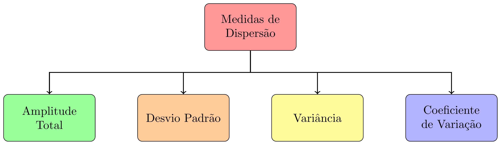

class: title-slide, center, middle
background-image: url(fig/slide-title/LMFTCA.png), url(fig/slide-title/ufpa.png), url(fig/slide-title/capa2.png)
background-position: 90% 90%, 10% 90%
background-size: 150px, 150px, cover

```{r setup, include=FALSE}
knitr::opts_chunk$set(
	error = FALSE,
	fig.align = "center",
	fig.showtext = TRUE,
	message = FALSE,
	warning = FALSE,
	cache = TRUE,
	collapse = TRUE,
	dpi = 600
)
```

```{r packages, include=FALSE}
# remotes::install_github("dill/emoGG")
library(ggplot2)
library(dplyr)
library(ggimage)
```

```{css, echo=FALSE}
.with-logo::before {
	content: '';
	width: 120px;
	height: 120px;
	position: absolute;
	bottom: 1.3em;
	right: -0.5em;
	background-size: contain;
	background-repeat: no-repeat;
}

.logo-ufpa::before {
	background-image: url(fig/slide-title/ufpa.png);
}
```

```{r xaringan-logo, echo=FALSE}
library(xaringanExtra)

use_logo(
  image_url = "fig/slide-title/LMFTCA.png",
  position = css_position(top = "1em", right = ".5em"),
  width = "130px",
  height = "130px")


use_scribble() # para escrever nos slides
use_share_again()
use_progress_bar()
#use_animate_all(style = c("slide_down"))

use_extra_styles(
  hover_code_line = TRUE,         #<<
  mute_unhighlighted_code = TRUE  #<<
)
xaringanExtra::use_editable(expires = 1)
#.can-edit[Você pode editar este título de slide]
#.can-edit.key-firstSlideTitle[Change this title and then reload the page]
use_clipboard()
```

```{r icon, echo=FALSE}
#remotes::install_github("mitchelloharawild/icons")
#remotes::install_github('emitanaka/anicon')
#library(icons)
#download_fontawesome()
#download_simple_icons()
```

<!-- title-slide -->
### Estatística Básica <br> (FL03017-EB)

## ᨒ <br>   `r anicon::faa("pagelines", animate="horizontal", colour="green")` Medidas de Dispersão `r anicon::faa("pagelines", animate="horizontal", colour="green")` <br> (ou Variabilidade)  <br> ᨒ

##### 〰〰〰〰〰〰🌱〰〰〰〰〰〰
##### ᨒ
##### .font120[**Prof. Dr. Deivison Venicio Souza**]
##### Universidade Federal do Pará (UFPA)
##### Faculdade de Engenharia Florestal
##### Laboratório de Manejo Florestal, Tecnologias e Comunidades Amazônicas
##### E-mail: deivisonvs@ufpa.br
<br>
##### 1ª versão: 06/abril/2021 <br> (Atualizado em: `r format(Sys.Date(),"%d/%B/%Y")`) <br> Altamira, Pará

---
layout: true
<div class="my-header"></div>
<div class="my-footer"><span>Prof. Dr. Deivison Venicio Souza (E-mail: deivisonvs@ufpa.br)&emsp;&emsp;&emsp;&emsp;&emsp;Estatística Básica (FL03017-EB) - Medidas de Dispersão (ou Variabilidade)</div>

---

## 📚 Ementa da disciplina (FL03017-EB)
<br>
.shadow4[
.font90[
1 - Introdução à estatística básica; 

2 - Distibuição de frequências;

3 - Medidas de tendência central (ou posição); 

4 - **Medidas de dispersão (ou variabilidade)**; 

5 - Medidas de assimetria e curtose;

6 - Testes de comparação de médias;

7 - Análise de correlação linear simples;

8 - Análise de regressão linear simples e múltipla; e

9 - Introdução à linguagem R para análise de dados.

]
]

---

## 🎯 Objetivos
<br><br>

.font80[
Ao final desta aula espera-se que o discente seja capaz de...

* Reconhecer e compreender as principais medidas de dispersão (ou variabilidade), entendendo seu papel na análise de dados;
* Calcular e interpretar medidas de dispersão, como amplitude, variância, desvio padrão e coeficiente de variação;
* Aplicar funções da linguagem R para o cálculo de medidas de dispersão em conjuntos de dados reais; e
* Compreender e construir gráficos do tipo BoxPlot e Dot Plot para visualizar e interpretar a dispersão dos dados, e potenciais outliers.
]

---

## Conteúdo
<br><br>

.font90[
**Medidas de dispersão (ou variabilidade)**

[1 - Conceito e importância](#ci)

[2 - Amplitude Total](#AT)

[4 - Variância](#Var)

[5 - Desvio Padrão](#Dp)

[6 - Coeficiente de Variação](#CV)
]

---

## Leitura complementar
<br>

.pull-left-4[
**Livro recomendado**
<br><br>

Morettin, Pedro Alberto; Bussab, Wilton Oliveira. **Estatística básica**. 9 ed., São Paulo: Saraiva, 2017, 554p.
<br><br>

**Parte 1** - Análise Exploratória de Dados (Capítulos 2 e 3).
<br><br>

Dados, códigos R (e outros) podem ser acessados em:

**Link**: <a href="https://www.ime.usp.br/~pam/EstBas.html">Estatística básica</a>

]

.pull-right-4[
```{r, echo=FALSE, out.width='60%', fig.align='center', fig.cap='', dpi=600}
knitr::include_graphics('fig/slide-title/Livro-Bussab.jpeg')
```
]

<!-- Slide XX -->
---
layout: false
name: conc
class: inverse, middle, center
background-image: url(fig/class0/sec.png)
background-size: cover

.font200[**Medidas de Dispersão <br> (ou Variabilidade)**]

---
layout: true
<div class="my-header"></div>
<div class="my-footer"><span>Prof. Dr. Deivison Venicio Souza (E-mail: deivisonvs@ufpa.br)&emsp;&emsp;&emsp;&emsp;&emsp;Estatística Básica (FL03017-EB) - Medidas de Dispersão (ou Variabilidade)</div>

---
name: mot
## Motivação: Porque calcular medidas de dispersão?
<br><br>

.shadow4[
.font90[
📊 **Medidas de tendência central:**
<br>

📍 **Foco:** Sintetizam o valor mais frequente ou o ponto central de uma distribuição de dados.
<br><br>

⚠️ **Limitação:** Isoladamente, essas medidas não permitem avaliar o **grau de variabilidade** (dispersão) entre os valores observados.
<br><br>

✅ **Solução:** utilizar medidas de dispersão (ou variabilidade), que descrevem a variabilidade dos dados.
]
]

---

## Motivação: Porque calcular medidas de dispersão?
<br>

### Inicialmente, vamos entender o que é dispersão...

.font80[
Imagine que foram realizadas duas amostras de cinco árvores. De cada árvore mediu-se a altura comercial, em metros:
]

.pull-left-5[
<br>
```{r echo=F, eval=T}

df <- data.frame(
  A1 = c(13, 14, 16, 19, 18),
  A2 = c(16, 16, 16, 16, 16)
  )

df %>% 
   DT::datatable(editable = 'cell', rownames = FALSE, style = "default",
                 class = "display", width = '200px',
                 caption = '',
     options=list(pageLength = 10, dom = 'tip', autoWidth = F,
       initComplete = htmlwidgets::JS(
          "function(settings, json) {",
          paste0("$(this.api().table().container()).css({'font-size': '", "12pt", "'});"),
          "}")
       ) 
     )
```

]

--

.pull-right-5[
```{r echo=T, eval=T}
colMeans(df)
```
.font80[
- A média aritmética das alturas de ambas as amostras é 16m.
- Na A1 as alturas variaram entre 13 e 19m. (**Existe dispersão**)
- Na A2 as árvores possuem mesma altura (16m). (**Não existe dispersão**)
<br><br>

**Na natureza, a variabilidade sempre existe, mesmo que muito pequena!**

]
]

---

## Motivação: Porque calcular medidas de dispersão?
<br>
### Exemplo 1: mesma média de DAP, dispersões diferentes...
.font80[
👉 Considere duas áreas florestais com medições de diâmetro (cm):
<br>
- 🌲 **Área A**: 28, 29, 30, 31, 32
- 🌳 **Área B**: 10, 20, 30, 40, 50
<br>
]

--

.font80[
📍 Observe que **diâmetro médio** das duas áreas é **30 cm**.
<br><br>
]

--

.font80[
⚠️ **Mas, atenção**:

- 🌲 **Área A**: baixa variabilidade (diâmetros próximos entre si) → povoamento equiâneo
- 🌳 **Área B**: alta variabilidade (diâmetros muito dispersos) → floresta inequiânea.
]

--

.font80[
<br>
📍 **Conclusão**: mesma média de diâmetros, variabilidade distinta → **estruturas florestais diferentes**.

📍 **Moral**: olhar apenas para a média não é suficiente — **a variabilidade também importa**.
]

---

## Motivação: Porque calcular medidas de dispersão?
<br>

### Exemplo 2: Olhar somente para a média pode ser enganoso...

.pull-left-5[
```{r echo=F, eval=T}

df <- data.frame(
  Tratamento = c(
    "SA+MO", "SA+MO", "SA+MO", "SA+MO", "SA+MO",
    "SA", "SA", "SA", "SA", "SA"),
  Altura = c(
    19.21, 19.83, 20.14, 20.81, 19.25,
    28.23, 29.67, 15.34, 16.23, 12.89
))

df %>% 
   DT::datatable(editable = 'cell', rownames = FALSE, style = "default",
                 class = "display", width = '250px',
                 caption = '',
     options=list(pageLength = 10, dom = 'tip', autoWidth = F,
       initComplete = htmlwidgets::JS(
          "function(settings, json) {",
          paste0("$(this.api().table().container()).css({'font-size': '", "12pt", "'});"),
          "}")
       ) 
     )

```
]

.pull-right-5[
.font80[
Considere que um experimento foi conduzido para avaliar o efeito de dois tipos de substratos:
<br>
👉 Solo Arenoso + Matéria Orgânica (SA+MO)

👉 Solo Arenoso (SA)

- **Objetivo**: Avaliar o efeito sobre o crescimento em altura de uma espécie florestal. 
- **Variável**: Alturas das plântulas (em cm), medidas após 30 dias de germinação.
- **Pergunta**: Em função do crescimento em altura pergunta-se: **Qual o melhor substrato para a produção de mudas da espécie?**

`r anicon::faa("hand-point-right", animate="horizontal")` **Importante**: O tipo de substrato indicado será usado para produção de mudas em larga escala. Portanto, é sempre desejável mudas de alta qualidade e uniformidade.


]
]

---

## Motivação: Porque calcular medidas de dispersão?
<br>

### Exemplo 2: Olhar somente para a média pode ser enganoso...

.font80[
- Em geral, a média aritmética é a primeira medida descritiva que calculamos:
]

.pull-left-4[
.font70[
```{r echo=T, eval=T}
df %>%
  group_by(Tratamento) %>% 
  summarise(media = sprintf("%.2f", mean(Altura)))
```

💡 **Interpretação** - Média das alturas:
- Em termos médios, parece não haver efeito significativo dos tratamentos.
- Avaliar a variância ajuda a "enxergar" o problema melhor.
- Para qual substrato o crescimento em altura foi mais uniforme?

]
]


.pull-right-4[
```{r echo=F, eval=T, collapse=T, out.width="70%", fig.align='center', fig.cap='', dpi=600}
df %>%
  ggplot(aes(Tratamento, Altura, fill = Tratamento)) +   
  geom_bar(position = "dodge", stat = "summary", 
           fun.y = "mean", alpha = .5) +
  stat_summary(fun = mean, geom = "text", aes(label = round(..y.., 2)), 
               vjust = -0.5, size = 6) +
  labs(title = "Altura média por tratamento") +
  theme_bw(base_size = 24) +
    theme(panel.grid = element_blank(),
          legend.position="none")
```

]

---

## Motivação: Porque calcular medidas de dispersão?
<br>

### Exemplo 2: Olhar somente para a média pode ser enganoso...

.font80[
- **Gráfico Dot Plot**: Ajuda a visualizar como a altura das plântulas variou para cada tratamento:
]

.pull-left-4[
```{r echo=F, eval=T, collapse=T, out.width="68%", fig.align='center', fig.cap='', dpi=600}
df %>%
  ggplot(aes(x=Tratamento, y=Altura, fill=Tratamento)) + 
    geom_dotplot(binaxis='y', stackdir='center') +
  stat_summary(fun.y=mean, geom="point", shape=18,
                 size=8, color="blue") +
  theme_bw(base_size = 24) +
  theme(panel.grid = element_blank(),
        legend.position="none"
        )
```
]

--

.pull-right-4[
.font70[
💡 **Interpretação** - Variância das alturas:
- O efeito do tratamento com **SA+MO** no crescimento foi **mais uniforme** (**< variância**).
- O efeito do tratamento com **SA** no crescimento foi **mais heterogêneo** (**> variância**).
- Portanto, **"olhar" apenas para média pode conduzir à indicação equivocada do melhor tratamento.**
]
]

---

name: ci
## Medidas de dispersão (ou variação)
<br>

### Conceito

É o espalhamento (dispersão) dos dados em torno de uma medida de tendência central.

`r anicon::faa("hand-point-right", animate="horizontal")` A média aritmética é a medida de tendência central comumente usada.

--
<br>
### Principais medidas de dispersão
```{r, echo=FALSE, out.width='60%', fig.align='center', fig.cap='', dpi=600}

```

---

## Medidas de dispersão (ou variação)
<br>

### Amplitude Total (AT)
<br>

É a medida mais simples de variabilidade.

É determinada pela diferença entre o maior e menor valor do conjunto de dados (Fávero et al., 2009).
<br><br>

.center[**AT = Valor Máximo - Valor Mínimo**]

--

.pull-left-4[
Seja a série:

**S1 = {1, 3, 0, 0, 2, 4, 1, 2, 5, 6, 8, 1, 2, 2, 0}**. 

- Qual a amplitude total dos dados?

**AT = 8 - 0 = 8**
]

--

.pull-right-4[
```{r echo=T, eval=T}
S1 <- c(1, 3, 0, 0, 2, 4, 1, 2, 5, 6, 8, 1, 2, 2, 0)
max(S1) - min(S1)
```

]

---

## Medidas de dispersão (ou variação)
<br>

### Amplitude Total (AT) - Limitações e Vantagens
<br>

.pull-left-4[
**Limitações**
- Apenas indica a existência (ou não) de dispersão;
- Usa apenas os valores extremos dos dados;
- É influenciada por valores extremos (*outliers*);
- É uma medida "fraca", pois não mede a dispersão interna. 

]

.pull-right-4[
**Vantagens**
- Matemática: Cálculo simples.
]

---

## Medidas de dispersão (ou variação)
<br>

### Medidas de dipersão em relação à média aritmética
<br>

A amplitude total é, em geral, um estimador **enviesado** e **ineficiente** da amplitude populacional. Isto porque, é pouco provável que uma amostra contenha os valores mínimos e máximos da população (Ferreira, 2009).
<br><br>

--

`r anicon::faa("hand-point-right", animate="horizontal")` As **limitações**, o **viés** e a **ineficiência** do estimador de amplitude total, despertaram para a necessidade de **novos 
estimadores de dispersão**.

`r anicon::faa("hand-point-right", animate="horizontal")` Assim, surgiram estimadores que estimam a dispersão dos dados tomando por referência uma medida de centralidade da distribuição.

Medidas de dipersão em relação à média aritmética: 
.green[desvio padrão, variância e coeficiente de variação].

---

## Medidas de dispersão (ou variação)
<br>

### Variância - Expressão matemática do estimador

As expressões matemáticas para os estimadores de variância (amostral e populacional) são:
<br>

--

.left-column[

- **Variância amostral**
$$
\normalsize
S^2 = \frac{1}{n-1}\sum_{i=1}^{n}\left (x_i - \bar{x}  \right )^2
$$
$$
\normalsize
S^2 = \frac{SQR}{n-1}
$$

`r anicon::faa("hand-point-right", animate="horizontal")` A variância amostral é representada por **s²**. 
(lê-se: "S-Quadrado")

]

--

.right-column[

- **Variância populacional**
$$
\normalsize
\sigma^2 = \frac{1}{N}\sum_{i=1}^{N}\left (X_i - \mu  \right )^2
$$
<br>

`r anicon::faa("hand-point-right", animate="horizontal")` A variância populacional é representada por **σ²**. 
(lê-se: "Sigma-Quadrado")

.font65[
**n - 1** = Grau de liberdade (penalizar a variância por tratar-se de amostra)

(**É razoável admitir que a variância amostral é maior do que a populacional!**)
]

]

---

## Medidas de dispersão (ou variação)
<br>

### Variância - Uma abordagem sem fórmulas

.pull-left-5[
```{r echo=F, eval=T}

df <- data.frame(
  Tratamento = c(
    "SA+MO", "SA+MO", "SA+MO", "SA+MO", "SA+MO",
    "SA", "SA", "SA", "SA", "SA"),
  Altura = c(
    19.21, 19.83, 20.14, 20.81, 19.25,
    28.23, 29.67, 15.34, 16.23, 12.89
))

df %>% 
   DT::datatable(editable = 'cell', rownames = FALSE, style = "default",
                 class = "display", width = '250px',
                 caption = '',
     options=list(pageLength = 10, dom = 'tip', autoWidth = F,
       initComplete = htmlwidgets::JS(
          "function(settings, json) {",
          paste0("$(this.api().table().container()).css({'font-size': '", "12pt", "'});"),
          "}")
       ) 
     )

```
]

.pull-right-5[

```{r echo=F, eval=T}

df <- data.frame(
  Tratamento = c(
    "SA+MO", "SA+MO", "SA+MO", "SA+MO", "SA+MO"),
  Altura = c(
    19.21, 19.83, 20.14, 20.81, 19.25
)) %>%
  mutate(Media = mean(Altura),
         "xi-media" = round(Altura - Media, 4),
         "(xi-media)²" = `xi-media`^2) %>%
  tibble::add_row(
    Tratamento = "Total",
    "xi-media" = round(sum(.$`xi-media`), 1),
    "(xi-media)²" = round(sum(.$`(xi-media)²`), 4))

df %>% 
   DT::datatable(editable = 'cell', rownames = FALSE, style = "default",
                 class = "display", width = '250px',
                 caption = '',
     options=list(pageLength = 10, dom = 'tip', autoWidth = F,
       initComplete = htmlwidgets::JS(
          "function(settings, json) {",
          paste0("$(this.api().table().container()).css({'font-size': '", "12pt", "'});"),
          "}")
       ) 
     )

```

SQR = **1,7757** (Variação total)

S² = SQR/n-1 = 1,7757/(5-1) = **0,4439 (cm)²** (Variação média)
]

---

## Medidas de dispersão (ou variação)
<br>

### Variância - Uma abordagem sem fórmulas

.pull-left-5[
```{r echo=F, eval=T}

df <- data.frame(
  Tratamento = c(
    "SA+MO", "SA+MO", "SA+MO", "SA+MO", "SA+MO",
    "SA", "SA", "SA", "SA", "SA"),
  Altura = c(
    19.21, 19.83, 20.14, 20.81, 19.25,
    28.23, 29.67, 15.34, 16.23, 12.89
))

df %>% 
   DT::datatable(editable = 'cell', rownames = FALSE, style = "default",
                 class = "display", width = '250px',
                 caption = '',
     options=list(pageLength = 10, dom = 'tip', autoWidth = F,
       initComplete = htmlwidgets::JS(
          "function(settings, json) {",
          paste0("$(this.api().table().container()).css({'font-size': '", "12pt", "'});"),
          "}")
       ) 
     )

```
]

.pull-right-5[

```{r echo=F, eval=T}

df <- data.frame(
  Tratamento = c(
    "SA", "SA", "SA", "SA", "SA"),
  Altura = c(
    28.23, 29.67, 15.34, 16.23, 12.89
)) %>%
  mutate(Media = mean(Altura),
         "xi-media" = round(Altura - Media, 4),
         "(xi-media)²" = `xi-media`^2) %>%
  tibble::add_row(
    Tratamento = "Total",
    "xi-media" = round(sum(.$`xi-media`), 1),
    "(xi-media)²" = round(sum(.$`(xi-media)²`), 4))

df %>% 
   DT::datatable(editable = 'cell', rownames = FALSE, style = "default",
                 class = "display", width = '250px',
                 caption = '',
     options=list(pageLength = 10, dom = 'tip', autoWidth = F,
       initComplete = htmlwidgets::JS(
          "function(settings, json) {",
          paste0("$(this.api().table().container()).css({'font-size': '", "12pt", "'});"),
          "}")
       ) 
     )

```

SQR = **246,6085** (Variação total)

S² = SQR/n-1 = 246,6085/(5-1) = **61,6521 (cm)²** (Variação média)
]

---

## Medidas de dispersão (ou variação)
<br>

### Variância - Usando a linguagem R

.pull-left-5[
```{r echo=F, eval=T}

df <- data.frame(
  Tratamento = c(
    "SA+MO", "SA+MO", "SA+MO", "SA+MO", "SA+MO",
    "SA", "SA", "SA", "SA", "SA"),
  Altura = c(
    19.21, 19.83, 20.14, 20.81, 19.25,
    28.23, 29.67, 15.34, 16.23, 12.89
))

df %>% 
   DT::datatable(editable = 'cell', rownames = FALSE, style = "default",
                 class = "display", width = '250px',
                 caption = '',
     options=list(pageLength = 10, dom = 'tip', autoWidth = F,
       initComplete = htmlwidgets::JS(
          "function(settings, json) {",
          paste0("$(this.api().table().container()).css({'font-size': '", "12pt", "'});"),
          "}")
       ) 
     )

```
]

.pull-right-5[
```{r echo=T, eval=T}
df %>%
  group_by(Tratamento) %>% 
  summarise(Variancia=var(Altura)) %>%
  as.data.frame()
```

]

---

## Medidas de dispersão (ou variação)
<br>

### Desvio Padrão - Conceito

Estima a dispersão dos dados em relação à média. Porém, o seu valor é dado na mesma unidade de medida da variável original.
<br><br>

**Matemática**: É a raiz quadrada da variância (amostral ou populacional).

---

## Medidas de dispersão (ou variação)
<br>

### Desvio Padrão - Expressão matemática do estimador

As expressões matemáticas para os estimadores de desvio padrão (amostral e populacional) são:
<br>

--

.pull-left-4[

- **Desvio padrão amostral**
$$
\normalsize
S = \sqrt{\frac{1}{n-1}\sum_{i=1}^{n}\left (x_i - \bar{x}  \right )^2}
$$
`r anicon::faa("hand-point-right", animate="horizontal")` O desvio padrão amostral é representado por **s**.

]

--

.pull-right-4[

- **Desvio padrão populacional**
$$
\normalsize
\sigma = \sqrt{\frac{1}{N}\sum_{i=1}^{N}\left (X_i - \mu  \right )^2}
$$
`r anicon::faa("hand-point-right", animate="horizontal")` O desvio padrão populacional é representado por **σ**. 
(lê-se: "Sigma")

]

---

## Medidas de dispersão (ou variação)
<br>

### Desvio Padrão - Manual e usando a linguagem R

.pull-left-1[
```{r echo=F, eval=T}

df <- data.frame(
  Tratamento = c(
    "SA+MO", "SA+MO", "SA+MO", "SA+MO", "SA+MO",
    "SA", "SA", "SA", "SA", "SA"),
  Altura = c(
    19.21, 19.83, 20.14, 20.81, 19.25,
    28.23, 29.67, 15.34, 16.23, 12.89
))

df %>% 
   DT::datatable(editable = 'cell', rownames = FALSE, style = "default",
                 class = "display", width = '250px',
                 caption = '',
     options=list(pageLength = 10, dom = 'tip', autoWidth = F,
       initComplete = htmlwidgets::JS(
          "function(settings, json) {",
          paste0("$(this.api().table().container()).css({'font-size': '", "12pt", "'});"),
          "}")
       ) 
     )

```
]

.pull-left-1[
**Usando Linguagem R**
```{r echo=T, eval=T}
df %>%
  group_by(Tratamento) %>% 
  summarise(DP=sd(Altura)) %>%
  as.data.frame()
```

]

.pull-right-3[
**Interpretação**
- O desvio das alturas em SA foi maior (7.85m).
- A desvio das alturas em SA+MO foi menor (0.67m).
]

.pull-left-1[
**Cálculo Manual**
$$
s_{SA} = \sqrt{s^2} = \sqrt{61.65212} = 7.85m
$$

$$
s_{SA+MO} = \sqrt{s^2} = \sqrt{0.44392} = 0.67m
$$
]


---

## Medidas de dispersão (ou variação)
<br>

### Coeficiente de Variação - Conceito
<br>

É uma medida calculada pela razão entre o desvio padrão e a média aritmética. Portanto, é uma medida de dispersão relativa, e expressa em porcentagem.
<br><br>

É útil para comparar a dispersão entre grupos para diferentes unidades de medidas (por exemplo, Altura e Diâmetro).


---

## Medidas de dispersão (ou variação)
<br>

### Coeficiente de Variação - Expressão matemática do estimador

As expressões matemáticas para os estimadores de coeficiente de variação (amostral e populacional) são:
<br>

--

.pull-left-4[

- **Coeficiente de variação amostral**
$$
\normalsize
CV(\%) = \left ( \frac{S}{\bar{x}} \right ).100
$$
]

--

.pull-right-4[

- **Coeficiente de variação populacional**
$$
\normalsize
CV(\%) = \left ( \frac{\sigma}{\mu} \right ).100
$$
]

---

## Medidas de dispersão (ou variação)
<br>

### Coeficiente de Variação - Manual e usando a linguagem R

.pull-left-1[
```{r echo=F, eval=T}

df <- data.frame(
  Tratamento = c(
    "SA+MO", "SA+MO", "SA+MO", "SA+MO", "SA+MO",
    "SA", "SA", "SA", "SA", "SA"),
  Altura = c(
    19.21, 19.83, 20.14, 20.81, 19.25,
    28.23, 29.67, 15.34, 16.23, 12.89
))

df %>% 
   DT::datatable(editable = 'cell', rownames = FALSE, style = "default",
                 class = "display", width = '250px',
                 caption = '',
     options=list(pageLength = 10, dom = 'tip', autoWidth = F,
       initComplete = htmlwidgets::JS(
          "function(settings, json) {",
          paste0("$(this.api().table().container()).css({'font-size': '", "12pt", "'});"),
          "}")
       ) 
     )

```
]

.pull-left-1[
**Usando Linguagem R**
```{r echo=T, eval=T}
df %>%
  group_by(Tratamento) %>% 
  summarise(
    CV=(sd(Altura)/mean(Altura))*100) %>%
  as.data.frame()
```

]

.pull-right-3[
**Interpretação**
- O CV das alturas em SA foi maior (38,35%).
- A CV das alturas em SA+MO foi menor (3,36%).
]

.pull-left-1[
**Cálculo Manual**
$$
CV_{SA} = 7,85/20,5 = 38,35\%
$$

$$
CV_{SA+MO} = 0,67/19,8 = 3,36\%
$$
]


---

## Resumos das estatísticas
<br>

### Vamos resumir as estatísticas (Experimento)
<br>

Resumo das estimativas encontradas para os tratamentos: SA e SA+MO...
<br>

.pull-left-1[
**Solo Arenoso**

Média = 20,5m

Variância = 61,6521m²

Desvio Padrão = 7,85m

Coeficiente de Variação = 38,35%
]


.pull-left-1[
**Solo Arenoso + Matéria Orgânica**

Média = 19,8m

Variância = 0,4439m²

Desvio Padrão = 0,67m

Coeficiente de Variação = 3,36%
]

---
## Referências
<br><br>
FÁVERO, L. P.; BELFIORE, P.; SILVA, F. L. da; CHAN, B. L. **Análise de dados: modelagem multivariada para tomada de decisões**. Rio de Janeiro: Elsevier, 2009. 646p.
<br><br>
FERREIRA, D. F. **Estatística básica**. 2 ed. rev. Lavras: Ed. UFLA, 2009. 664 p.

<!--Slide XX -->
---
layout: false
name: etim
class: inverse, middle, center
background-image: url(fig/class0/sec.png)
background-size: cover

## .font200[Obrigado!]

```{r, echo=FALSE, out.width='20%', fig.align='center', fig.cap='', dpi=600}
knitr::include_graphics('fig/slide-title/LMFTCA.png')
```

👨🏻‍👩🏻‍👦🏻‍👦🏻 [@lmftca_ufpa](https://www.instagram.com/lmftca_ufpa/)

🌎 [https://www.lmftca.com.br/](https://www.lmftca.com.br/)
