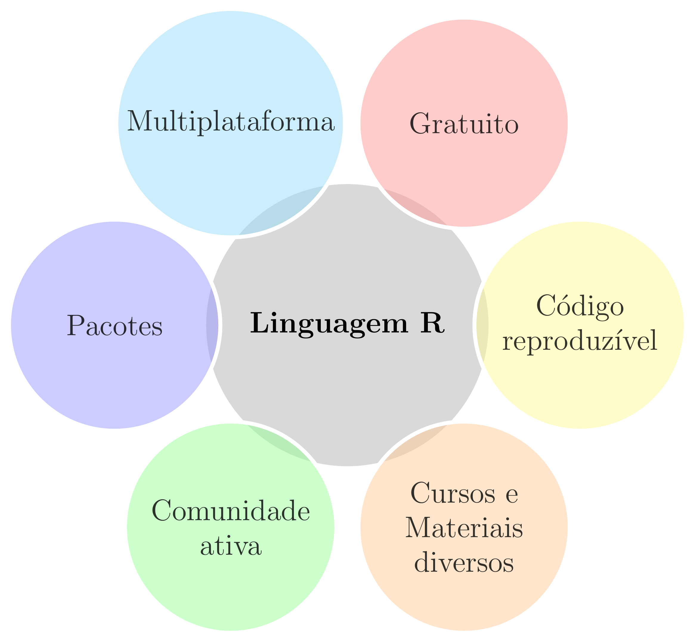
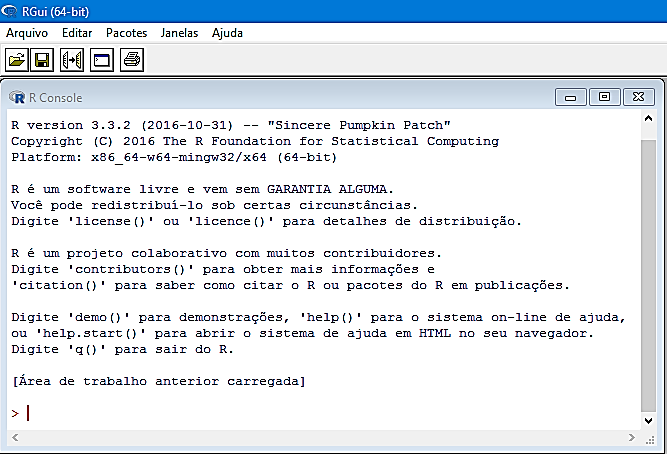
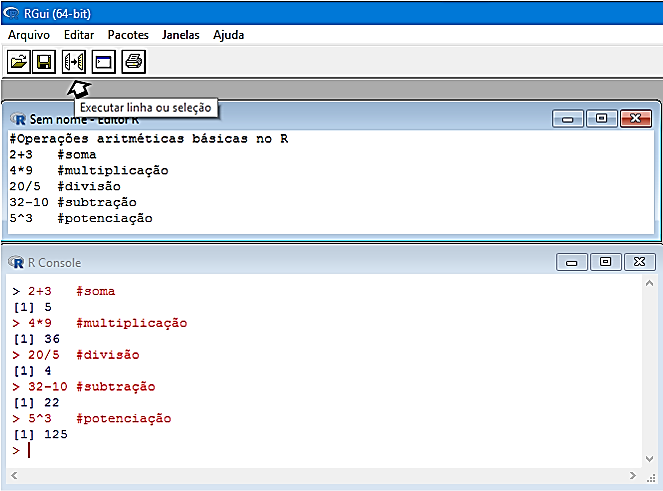
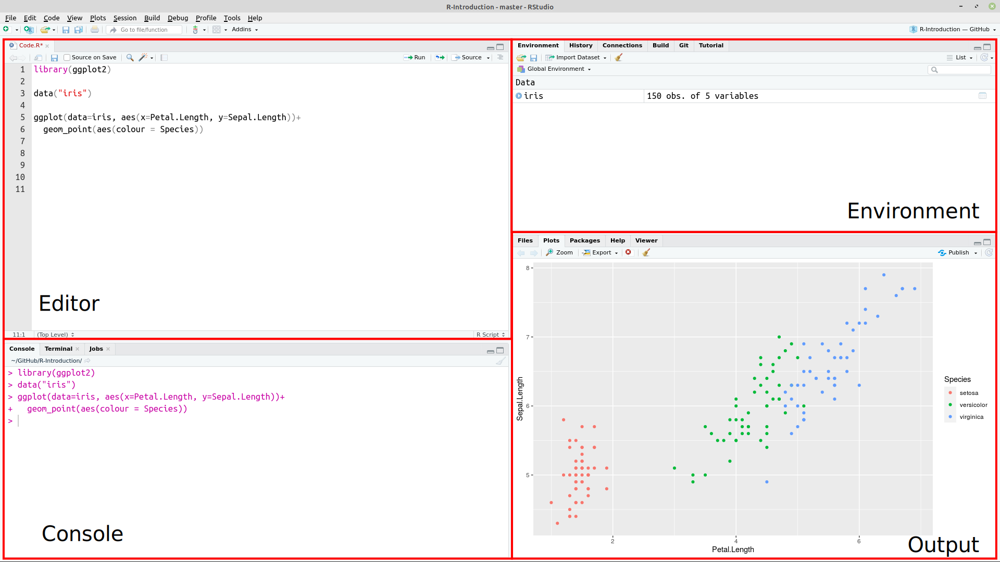

class: title-slide, center, middle
background-image: url(fig/slide-title/LMFTCA.png), url(fig/slide-title/ufpa.png), url(fig/slide-title/capa2.png)
background-position: 90% 90%, 10% 90%
background-size: 150px, 150px, cover

```{r setup, include=FALSE}
knitr::opts_chunk$set(
  fig.showtext = TRUE,
  fig.align = "center", 
  cache = FALSE,
  error = FALSE,
  message = FALSE, 
  warning = FALSE, 
  collapse = TRUE ,
  dpi = 600)
```

```{css, echo=FALSE}
.with-logo::before {
	content: '';
	width: 120px;
	height: 120px;
	position: absolute;
	bottom: 1.3em;
	right: -0.5em;
	background-size: contain;
	background-repeat: no-repeat;
}

.logo-ufpa::before {
	background-image: url(fig/slide-title/ufpa.png);
}

.logo-dplyr::before {
	background-image: url(https://github.com/rstudio/hex-stickers/raw/master/PNG/dplyr.png);
}

.logo-purrr::before {
	background-image: url(https://github.com/rstudio/hex-stickers/raw/master/PNG/purrr.png);
}

.logo-plumber::before {
	background-image: url(https://github.com/rstudio/hex-stickers/raw/master/PNG/plumber.png);
}
```

```{r packages, include=FALSE}
# remotes::install_github("dill/emoGG")
library(ggplot2)
library(dplyr)
library(ggimage)
library(kableExtra)
```

```{r xaringan-logo, echo=FALSE}
library(xaringanExtra)
use_logo(
  image_url = "fig/slide-title/LMFTCA.png",
  position = css_position(top = "1em", right = ".5em"),
  width = "130px",
  height = "130px")

use_scribble() # para escrever nos slides
use_share_again()
use_progress_bar()
#use_animate_all(style = c("slide_down"))

use_extra_styles(
  hover_code_line = TRUE,         #<<
  mute_unhighlighted_code = TRUE  #<<
)
xaringanExtra::use_editable(expires = 1)
#.can-edit[Você pode editar este título de slide]
#.can-edit.key-firstSlideTitle[Change this title and then reload the page]
use_clipboard()
```

```{r icon, echo=FALSE}
#remotes::install_github("mitchelloharawild/icons")
#remotes::install_github('emitanaka/anicon')
#library(icons)
#download_fontawesome()
#download_simple_icons()
```


<!-- title-slide -->
### Estatística Básica <br> (FL03017-EB)

## ᨒ <br>   `r anicon::faa("pagelines", animate="horizontal", colour="green")` Introdução à Linguagem R `r anicon::faa("pagelines", animate="horizontal", colour="green")` <br> 🍃 .font70[.brand-green[(Conhecendo R e Rstudio)]] 🍃  <br> ᨒ

##### 〰〰〰〰〰〰🌱〰〰〰〰〰〰
##### ᨒ
##### .font120[**Prof. Dr. Deivison Venicio Souza**]
##### Universidade Federal do Pará (UFPA)
##### Faculdade de Engenharia Florestal
##### Laboratório de Manejo Florestal, Tecnologias e Comunidades Amazônicas
##### E-mail: deivisonvs@ufpa.br
<br>
##### 1ª versão: 16/abril/2021 <br> (Atualizado em: `r format(Sys.Date(),"%d/%B/%Y")`) <br> Altamira, Pará

---
layout: true
class: with-logo logo-ufpa
<div class="my-header"></div>
<div class="my-footer"><span>Prof. Dr. Deivison Venicio Souza (E-mail: deivisonvs@ufpa.br)&emsp;&emsp;&emsp;&emsp;&emsp; <div3>Estatística Básica (FL03017-EB)</div3>/ <div2>Introdução à Linguagem R: Conhecendo R e Rstudio</div2> </div>

---

## Objetivos
<br><br>
Ao final desta aula espera-se que os discentes sejam capazes de:

* Compreender a importância do uso de linguagens de programação, reconhecendo sua aplicabilidade em diferentes contextos;
* Realizar o download e a instalação do R e do RStudio;
* Identificar e compreender os principais elementos da interface do RGui e do RStudio;
* Utilizar funções matemáticas básicas disponíveis no ambiente R; e
* Executar comandos fundamentais para manipulação inicial de dados.

---

## Conteúdo

.pull-left-4[
**Parte 1 - Conhecendo o R e o IDE Rstudio**

[1- A linguagem R](#R)

[2 - Por que usar a linguagem R?](#pqR)

[3 - RGui - Download, instalação e interface](#RGui)

[4 - IDE RStudio - Download, instalação e interface](#Rstudio)

]

.pull-right-4[
.pull-down[
**Parte 2 - Estrutura de dados na linguagem R**

[1 - Sintaxe da linguagem R](#Sint)

[2 - Operadores no R](#Oper)

&nbsp;&nbsp;&nbsp;&nbsp;[2.1 - Aritméticos](#arit)

&nbsp;&nbsp;&nbsp;&nbsp;[2.2 - Relacionais](#relac)

&nbsp;&nbsp;&nbsp;&nbsp;[2.3 - Lógicos](#log)

[3 - Funções matemáticas usuais](#FunsMat)

]
]

---
layout: false
name: conc
class: inverse, middle, center
background-image: url(fig/class0/sec.png)
background-size: cover

.font200[**Introdução à Linguagem R] <br> 
.font150[.blue[(Conhecendo R e Rstudio)]**]

---
layout: true
<div class="my-header"></div>
<div class="my-footer"><span>Prof. Dr. Deivison Venicio Souza (E-mail: deivisonvs@ufpa.br)&emsp;&emsp;&emsp;&emsp;&emsp;Estatística Básica (FL03017-EB) - Introdução à Linguagem R: Conhecendo R e Rstudio</div>

---
name: R
## Linguagem R

.pull-left-4[
.font90[
- É uma linguagem de programação de computadores de código aberto e gratuita;
- Criada em 1993: Ross Ihaka e por Robert Gentleman;
- Departamento de Estatística da Universidade de Auckland, Nova Zelândia;
- O R foi desenvolvido a partir da Linguagem S.
]
]

.pull-right-4[
.font90[
**Possui múltiplas facetas:**

- Pacotes para implementação de métodos estatísticos;
- Pacotes para manipulação de dados;
- Pacotes para visualização gráfica elegantes;
- Pacotes para criação de aplicações web, Dashboard;
- Pacote para geração de relatórios dinâmicos;
- Pacotes para criação de apresentações elegantes.
]
]


.pull-left-7[
```{r echo=FALSE, out.width='30%', fig.align='center', fig.cap='', dpi=600}
knitr::include_graphics("https://tidyverse.tidyverse.org/articles/tidyverse-logo.png")
```
]

.pull-left-7[
```{r echo=FALSE, out.width='30%', fig.align='center', fig.cap='', dpi=600}
knitr::include_graphics("https://ggplot2.tidyverse.org/logo.png")
```
]

.pull-left-7[
```{r echo=FALSE, out.width='30%', fig.align='center', fig.cap='', dpi=600}
knitr::include_graphics("https://blog.efpsa.org/wp-content/uploads/2019/04/pic1.png")

```

]

.pull-left-7[
```{r echo=FALSE, out.width='30%', fig.align='center', fig.cap='', dpi=600}
knitr::include_graphics("https://pkgs.rstudio.com/rmarkdown/reference/figures/logo.png")
```
]

.pull-left-7[
```{r echo=FALSE, out.width='30%', fig.align='center', fig.cap='', dpi=600}
knitr::include_graphics("https://user-images.githubusercontent.com/163582/45438104-ea200600-b67b-11e8-80fa-d9f2a99a03b0.png")

```
]

---
name: pqR
## Por que usar a linguagem R?

```{r, echo=FALSE, out.width='50%', fig.align='center', fig.cap='', dpi=600}

```

---
name: RGui
## RGui - Download e instalação
<br>

**1⁰ Passo**: Acessar a página do projeto R em: https://www.r-project.org/;

**2⁰ Passo**: Do lado esquerdo da página clique sobre o menu .green[CRAN];

**3⁰ Passo**: Será aberta uma página com diversos links de .green[CRAN Mirrors], isto é, espelhos CRAN. 
<br>
Veja na tabela a seguir os principais espelhos disponíveis no Brasil.
<br><br>

.center2[
```{r echo=FALSE}
df <- data.frame(Link = 
                   c("http://cran-r.c3sl.ufpr.br/",
                     "http://nbcgib.uesc.br/mirrors/cran/", 
                     "https://cran.fiocruz.br/",
                     "https://vps.fmvz.usp.br/CRAN/",
                     "http://brieger.esalq.usp.br/CRAN/"),
                 Instituição = 
                   c("Universidade Federal do Paraná - UFPR",
                     "Center for Comp Biol at Universidade Estadual de Santa Cruz",
                     "Oswaldo Cruz Foundation, Rio de Janeiro",
                     "University of São Paulo, São Paulo",
                     "University of São Paulo, Piracicaba")
                 )

df %>% 
   DT::datatable(editable = 'cell', rownames = FALSE, style = "default",
                 class = "display", width = '750px',
                 caption = '',
     options=list(pageLength = 10, dom = 'tip', autoWidth = F,
       initComplete = htmlwidgets::JS(
          "function(settings, json) {",
          paste0("$(this.api().table().container()).css({'font-size': '", "12pt", "'});"),
          "}")
       ) 
     )
```
]

---

## RGui - Download e instalação
<br>

**4⁰ Passo**: Na página http://cran-r.c3sl.ufpr.br/, na seção .green[Download and Install R], clicar em um dos três links, conforme o Sistema Operacional do usuário:

1. Download R for Windows;
2. Download R for Linux; ou
3. Download R for MacOS.
<br>

**5⁰ Passo**: Clicar no link do .green[subdiretório base] ou em o .green[install R for the first time] para instalar o R pela primeira vez;
<br>

**6⁰ Passo**: Clicar, por exemplo, em .green[Download R-4.1.0. for Windows] (.red[escolha seu SO]). Assim, será iniciado o download do R Development Core Team para o respectivo sistema; e
<br>

**7⁰ Passo**: Por fim, basta usar o setup baixado para instalar o programa.

---

## RGui - Interface
<br>

Ao inicializar o **R Development Core Team** pela primeira vez aparecerá a seguinte imagem:

```{r, echo=FALSE, out.width='50%', fig.align='center', fig.cap='R Console'}

```

---

## RGui - Interface

- No contato inicial do usuário com o RGui tem-se a visão do .green[R Console].
- O sinal .red[>] é o prompt de comando.
- Execute as funções .green[demo(), help(), help.start(), q()].

```{r, echo=FALSE, out.width='50%', fig.align='center', fig.cap='R Console'}

```

---

## RGui - R editor

O RGui possui um .green[R editor] $\rightarrow$ Abrir script.

```{r, echo=FALSE, out.width='50%', fig.align='center', fig.cap='R editor'}

```

---
name: Rstudio
## IDE RStudio - download e instalação
<br>

O .green[RStudio] é um ambiente de desenvolvimento integrado (*Integrated Development Environment - IDE*) de códigos em R mais comumente usado por usuários da linguagem.

**1⁰ Passo**: Acessar a página do projeto RStudio: https://www.rstudio.com;

**2⁰ Passo**: Products $\rightarrow$ RStudio;

**3⁰ Passo**: Selecionar a versão do RStudio para Desktop;

**4⁰ Passo**: Na edição Open source $\rightarrow$ Download Rstudio Desktop;

**5⁰ Passo**: Por fim, basta usar o setup baixado para instalar o programa.
<br><br>

```{r, echo=FALSE, out.width='30%', fig.align='center', fig.cap=''}
knitr::include_graphics('fig/Class6/RStudio.png')
```

---

## IDE RStudio - Interface

```{r, echo=FALSE, out.width='80%', fig.align='center', fig.cap=''}

```
<!-- http://material.curso-r.com/rbase/ -->

---

## IDE RStudio - Interface (Painéis)
<br>

**Editor**: Painel de desenvolvimento dos códigos R.

**Environment**: Painel onde aparecerão todos os objetos criados no R.

**Console**: Painel para rodar os códigos R e receber outputs.

**Plots**: Painel de saída gráfica.

**History**: Painel que mostra um histórico dos comandos executados na sessão corrente.

**Help**: Painel que mostra a documentação de funções de pacotes, quando solicitada.

**Files**: Painel para identificar arquivos no diretório de trabalho.

**Packages**: Painel que mostra os pacotes instalados. É possível identificar os pacotes carregados na sessão corrente.

---
layout: false
name: conc
class: inverse, middle, center
background-image: url(fig/class0/sec.png)
background-size: cover

.font200[**Introdução à Linguagem R] <br> 
.font150[.blue[(Algumas funções e comandos Básicos)]**]

---
layout: true
<div class="my-header"></div>
<div class="my-footer"><span>Prof. Dr. Deivison Venicio Souza (E-mail: deivisonvs@ufpa.br)&emsp;&emsp;&emsp;&emsp;&emsp;Estatística Básica (FL03017-EB) - Introdução à Linguagem R: Funções e Comandos Básicos</div>

---
name: FunsMat
## Um pouco mais sobre o R
<br>

### Funções matemáticas usuais

A linguagem R dispõe de funções matemáticas usualmente encontradas em calculadoras científicas.
<br><br>


| Função                 | Descrição                        |
|------------------------|----------------------------------|
| sqrt()                 | Raiz quadrada                    |
| abs()                  | Valor absoluto                   |
| sin(); cos(); tan()    | Funções trigonométricas          |
| asin(); acos(); atan() | Funções trigonométricas inversas |
| exp()                  | Exponencial                      |
| log10()                | Logarítmo na base 10             |
| log()                  | Logarítmo natural                |
| factorial              | Fatorial                         |

---

## Um pouco mais sobre o R
<br>

### Alguns comandos básicos
<br>

.font80[
| **Comando**                             | **Ação**                                      |
| :-------------------------------------: | :-------------------------------------------: |
| q()                                     | Fechar o programa                             |
| rm(nome do objeto)                      | Remover um objeto qualquer                    |
| ls()                                    | Listar os objetos na janela de trabalho atual |
| help(nome da função) ou ?nome da função | Solicitar ajuda sobre o uso de uma função     |
| save.image()                            | Salvar                                        |
| Ctrl + L                                | Limpar a tela do R console                    |
| history(max.show, nrow = 3)             | Listar os últimos 3 comandos executados       |
| getwd()                                 | Mostrar o diretório de trabalho               |
| setwd("diretório desejado")             | Mudar o diretório de trabalho                 |
| install.packages("nome do pacote")      | Instalar um pacote específico                 |
]

---

## Um pouco mais sobre o R
<br>

### Alguns comandos básicos (cont.)
<br>

.font80[
| **Comando**               | **Ação**                                       |
| :-----------------------: | :--------------------------------------------: |
| library("nome do pacote") | Carregar um pacote específico                  |
| dir()                     | Lista os arquivos existentes no diretório      |
| getOption("OutDec")       | Verificar o separador decimal definido         |
| options("OutDec=")        | Mudar o separador decimal para vírgula         |
| round(5.9845, digits=2)  | Função para arredondamento de casas decimais   |
| data()                    | Lista de conjuntos de dados disponíveis no R             |
| ?nomedodataset            | Obter informações detalhadas sobre um conjunto de dado |
| class(nome do objeto)     | Verifica a classe de um objeto específico      |
| search()                  | Lista todos os pacotes carregados              |
]


<!--Slide XX -->
---
layout: false
name: etim
class: inverse, middle, center
background-image: url(fig/class0/sec.png)
background-size: cover

## .font200[Obrigado!]

```{r, echo=FALSE, out.width='20%', fig.align='center', fig.cap='', dpi=600}
knitr::include_graphics('fig/slide-title/LMFTCA.png')
```

👨🏻‍👩🏻‍👦🏻‍👦🏻 [@lmftca_ufpa](https://www.instagram.com/lmftca_ufpa/)

🌎 [https://www.lmftca.com.br/](https://www.lmftca.com.br/)

