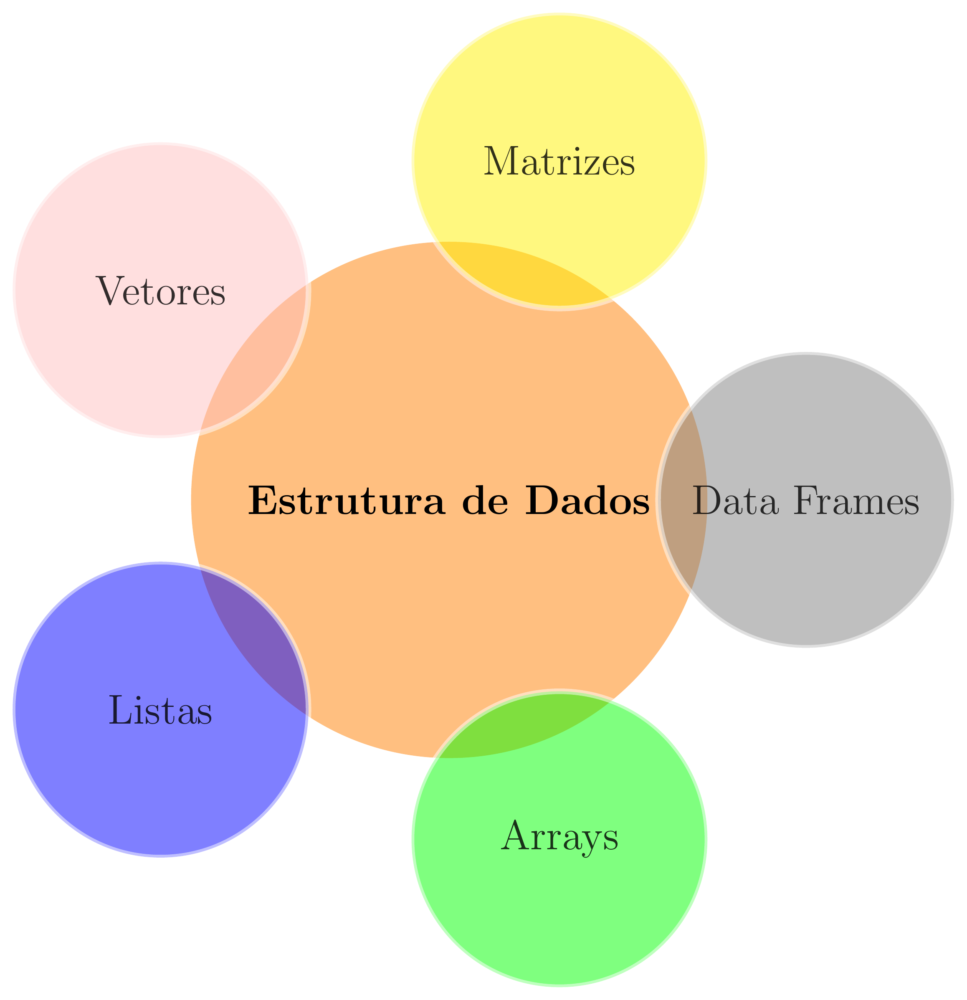
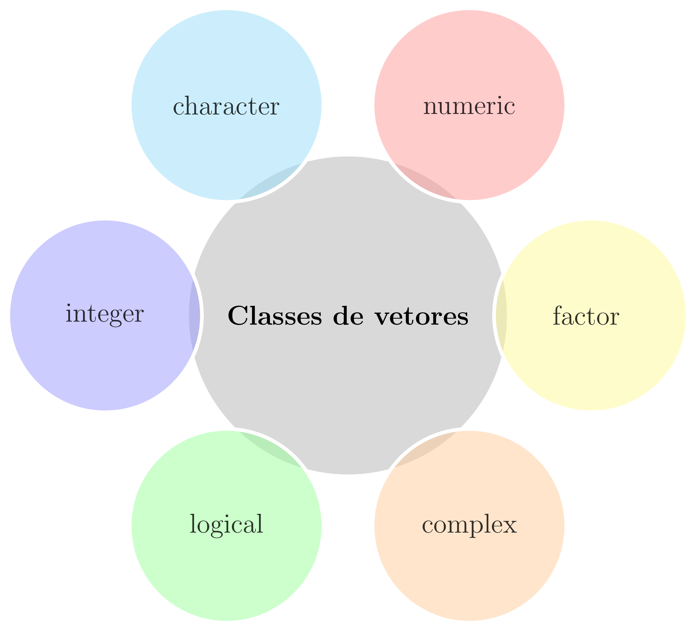

class: title-slide, center, middle
background-image: url(fig/slide-title/LMFTCA.png), url(fig/slide-title/ufpa.png), url(fig/slide-title/capa2.png)
background-position: 90% 90%, 10% 90%
background-size: 150px, 150px, cover

```{r setup, include=FALSE}
knitr::opts_chunk$set(
  fig.showtext = TRUE,
  fig.align = "center", 
  cache = FALSE,
  error = FALSE,
  message = FALSE, 
  warning = FALSE, 
  collapse = TRUE ,
  dpi = 600)
```

```{css, echo=FALSE}
.with-logo::before {
	content: '';
	width: 120px;
	height: 120px;
	position: absolute;
	bottom: 1.3em;
	right: -0.5em;
	background-size: contain;
	background-repeat: no-repeat;
}

.logo-ufpa::before {
	background-image: url(fig/slide-title/ufpa.png);
}

.logo-dplyr::before {
	background-image: url(https://github.com/rstudio/hex-stickers/raw/master/PNG/dplyr.png);
}

.logo-purrr::before {
	background-image: url(https://github.com/rstudio/hex-stickers/raw/master/PNG/purrr.png);
}

.logo-plumber::before {
	background-image: url(https://github.com/rstudio/hex-stickers/raw/master/PNG/plumber.png);
}
```

```{r packages, include=FALSE}
# remotes::install_github("dill/emoGG")
library(ggplot2)
library(dplyr)
library(ggimage)
library(kableExtra)
```

```{r xaringan-logo, echo=FALSE}
library(xaringanExtra)
use_logo(
  image_url = "fig/slide-title/LMFTCA.png",
  position = css_position(top = "1em", right = ".5em"),
  width = "130px",
  height = "130px")

use_scribble() # para escrever nos slides
use_share_again()
use_progress_bar()
#use_animate_all(style = c("slide_down"))

use_extra_styles(
  hover_code_line = TRUE,         #<<
  mute_unhighlighted_code = TRUE  #<<
)
xaringanExtra::use_editable(expires = 1)
#.can-edit[Você pode editar este título de slide]
#.can-edit.key-firstSlideTitle[Change this title and then reload the page]
use_clipboard()
```

```{r icon, echo=FALSE}
#remotes::install_github("mitchelloharawild/icons")
#remotes::install_github('emitanaka/anicon')
#library(icons)
#download_fontawesome()
#download_simple_icons()
```


<!-- title-slide -->
### Estatística Básica <br> (FL03017-EB)

## ᨒ <br>   `r anicon::faa("pagelines", animate="horizontal", colour="green")` Introdução à Linguagem R `r anicon::faa("pagelines", animate="horizontal", colour="green")` <br> 🍃 .font70[.brand-green[(Estrutura de Dados)]] 🍃  <br> ᨒ

##### 〰〰〰〰〰〰🌱〰〰〰〰〰〰
##### ᨒ
##### .font120[**Prof. Dr. Deivison Venicio Souza**]
##### Universidade Federal do Pará (UFPA)
##### Faculdade de Engenharia Florestal
##### Laboratório de Manejo Florestal, Tecnologias e Comunidades Amazônicas
##### E-mail: deivisonvs@ufpa.br
<br>
##### 1ª versão: 16/abril/2021 <br> (Atualizado em: `r format(Sys.Date(),"%d/%B/%Y")`) <br> Altamira, Pará

---
layout: true
class: with-logo logo-ufpa
<div class="my-header"></div>
<div class="my-footer"><span>Prof. Dr. Deivison Venicio Souza (E-mail: deivisonvs@ufpa.br)&emsp;&emsp;&emsp;&emsp;&emsp; <div3>Estatística Básica (FL03017-EB)</div3>/ <div2>Introdução à Linguagem R: Estrutura de Dados</div2> </div>

---

## Objetivos
<br><br>
Ao final desta aula espera-se que os discentes sejam capazes de:

* Compreender as principais estruturas de dados utilizadas na linguagem R;
* Diferenciar conceitualmente e na prática as estruturas: vetor, matriz, array, data frame e lista; e
* Utilizar funções essenciais para criação e manipulação dessas diferentes estruturas de dados.

---

## Conteúdo

.pull-left-4[
**Estrutura de dados na linguagem R**

[1 - Vetores](#vet)

[2 - Matrizes](#mat)

[3 - Arrays](#arrays)

[4 - Data Frames](#df)

[5 - Listas](#list)

]

---
layout: false
name: conc
class: inverse, middle, center
background-image: url(fig/class0/sec.png)
background-size: cover

.font200[**Introdução à Linguagem R] <br> 
.font150[.blue[(Estrutura de Dados)]**]

---
layout: true
<div class="my-header"></div>
<div class="my-footer"><span>Prof. Dr. Deivison Venicio Souza (E-mail: deivisonvs@ufpa.br)&emsp;&emsp;&emsp;&emsp;&emsp;Estatística Básica (FL03017-EB) - Introdução à Linguagem R: Estrutura de Dados</div>

---

## Estrutura de dados na linguagem R

- O R pode armazenar dados em diferentes estruturas.

```{r echo=FALSE, out.width='40%', fig.align='center', fig.cap='', dpi=600}

```


<!-- .pull-right-4[ -->
<!-- .font90[ -->
<!-- **Vetores - Características**  -->

<!-- a) Sequência de elementos; b) possui uma dimensão; c) admitem apenas elementos da mesma natureza. -->

<!-- **Matrizes - Características**  -->

<!-- a) Admite duas dimensões (linhas e colunas); b) formada por elementos de uma única classe. -->

<!-- **Data Frames - Características**  -->

<!-- a) Admite duas dimensões (linhas e colunas); b) Pode reunir vetores de diferentes classes, com a condição de possuírem igual -->
<!-- comprimento. -->

<!-- **Lista - Características** -->

<!-- a) Admite diferentes estruturas de dados (vetores, matrizes, data frames e inclusive outras listas). -->

<!-- ] -->
<!-- ] -->

---

## Estrutura de dados na linguagem R

- O R pode armazenar dados em diferentes estruturas

```{r echo=FALSE, out.width='80%', fig.align='center', fig.cap='', dpi=600}
knitr::include_graphics("http://venus.ifca.unican.es/Rintro/_images/dataStructuresNew.png")
```
.font70[
**Fonte**: http://venus.ifca.unican.es/Rintro/dataStruct.html]

---
name: vet
## Estrutura de dados na linguagem R
<br>

### Vetores

.pull-left-4[
- É a forma mais simples de armazenar dados no R;
- São caracterizados por possuírem somente uma dimensão;
- Todos os seus elementos constituintes devem ter, obrigatoriamente, a mesma natureza (classe).
]


.pull-right-4[
.center[**Principais classes de vetores**]
<br>

```{r echo=FALSE, out.width='75%', fig.align='center', fig.cap='', dpi=600}

```
]

---

## Estrutura de dados na linguagem R
<br>

### Vetores - Principais funções do R-base para criar vetores...
<br>

.pull-left-4[
**1. Função .black[c() (concatenate)]**

Função genérica que permite concatenar (combinar) argumentos para formar um vetor.
<br><br>

**2. Função .black[seq() (sequence)]**

Função genérica usada para gerar sequências de números em intervalos pré-definidos.
]


.pull-right-4[
**3. Função .black[rep() (replicate)]**

Função genérica usada para replicar um elemento “x”.
<br><br>

**4. Função .black[scan()]**

Usada para criar vetores diretamente no R Console.
]

---

## Estrutura de dados na linguagem R
<br>

### Vetores - .black[Função c() (concatenate)]

.pull-top[
.pull-left-4[
**Classe "character"**
```{r, echo=T, eval=F}
# Cria um vetor
c("Acapu", "Araucaria", "Mogno", "Cedro")
```

```{r, echo=T, eval=F}
# Cria um vetor e faz atribuição
especie <- c("Acapu", "Mogno", "Cedro", "Ipe")
#class(especie)
```
]

.pull-right-4[
**Classe "numeric"**
```{r, echo=T, eval=F}
# Cria um vetor
c(23.0, 27.0, 33.6, 42.6, 52.1)
```

```{r, echo=T, eval=F}
# Cria um vetor e faz atribuição
diametro <- c(23.0, 27.0, 33.6, 42.6, 52.1)
#class(diametro)
```
]
]

---

## Estrutura de dados na linguagem R
<br>

### Vetores - .black[Função c() (concatenate)]

.pull-left-10[
**Classe "factor"**
.font90[
- Por padrão, ao concatenar **strings** cria-se um vetor de classe **character**.
- Se desejável, pode-se codificar um vetor de classe **character** para a classe **factor**.
- O R-base possui duas funções: .green[factor()] e .green[as.factor()].
- Motivos: modelos estatísticos e gráficos
]
]

.pull-right-10[
```{r, echo=T, eval=T}
# Cria um vetor - Fitofisionomia
(Fito <- c("FOM", "FOA", "FOM", "FOM", "FOM", "FOA"))
class(Fito)
```

```{r, echo=T, eval=T}
# Codifica para "factor"
Fito <- c("FOM", "FOA", "FOM", "FOM", "FOM", "FOA")
(Fito <- factor(Fito))
class(Fito)
```
]

---

## Estrutura de dados na linguagem R
<br>

### Vetores - .black[Função c() (concatenate)]

.pull-left-10[
**Classe "factor" - declarando hierarquia**
.font90[
- Por padrão, os níveis (levels) de um vetor de classe **factor** ficam dispostos em ordem alfabética.
- Em algumas situações, pode ser desejável estabelecer uma hierarquia entre esses níveis.
- Por exemplo, imagine a variável mês de coleta. É evidente que existe hierarquia entre os meses.
]
]

.pull-right-10[
.font90[
**Níveis do mês não ordenados**
```{r}
(mes <- factor(
  c("Janeiro", "Abril", "Julho", "Outubro")
  ))
```

**Níveis do mês ordenados**

```{r size=3}
(mes <- 
   factor(x = mes,
          levels = c("Janeiro", "Abril", 
                     "Julho", "Outubro"),
               ordered = TRUE))
```

]
]

---

## Estrutura de dados na linguagem R
<br>

### Vetores - .black[Função seq() (sequence)]
<br>

.blockquote[
.center[.blue[seq(]**from** = ?, **to** = ?, **by** = ?, **length.out** = ?, **along.with** = ?.blue[)]]
<br>

.font90[
**from** = define um valor inicial (start) para a sequência.

**to** = define um valor máximo para a sequência.

**by** = define um valor incremental para a sequência.

**length.out** = define o comprimento da sequência dentro de um intervalo.

**along.with** = define uma sequência de inteiros do tamanho do argumento repassado.
]
]

---

## Estrutura de dados na linguagem R
<br>

### Vetores - .black[Função seq() (sequence)]

.pull-top[
.pull-left-4[
```{r seq1, echo=T, eval=F}
# 1 a 10, com intervalo 1.
seq(10)

# Sequência de 1 a 10, com intervalo 1.
seq(1:10)

# Sequência de 1 a 10, com intervalo 1.
seq(from = 1, to = 10, by = 1)

# Sequência de -2 a 10, com intervalo 2.
seq(from = -2, to = 10, by = 2)

# Sequência de 11 números entre 0 e 1.
seq(from=0, to=1, length.out = 5)

# Sequência do tamanho do vetor-espécie.
especie <- c("Acapu", "Mogno", "Cedro", "Ipe")
seq(along.with = especie)
```
]

.pull-right-4[
```{r ref.label="seq1", echo=FALSE, eval=TRUE, collapse=TRUE}
```
]
]

---

## Estrutura de dados na linguagem R
<br>

### Vetores - .black[Função rep() (replicate)]
<br>

.blockquote[
.center[.blue[rep(]**x** = ?, **times** = ?, **each** = ?.blue[)]]
<br>

.font90[
**x** = escalar, vetor ou uma lista, entre outros.

**times** = um vetor de inteiro (não negativo) indicando quantas vezes repetir cada elemento.

**each** = cada elemento de x é repetido n vezes.
]
]

---

## Estrutura de dados na linguagem R
<br>

### Vetores - .black[Função rep() (replicate)]

.pull-top[
.pull-left-4[
.font90[
```{r rep1, echo=T, eval=F}
# Repete a sequência de 1 a 4 (2x).
rep(x = 1:4, 2)

# Repete a sequência de 1 a 4 (3x).
rep(x = 1:4, times = 3)

# Repete cada valor em "x" (2x).
rep(x = 1:4, each = 2)

# Repete cada valor em "x" (2x).
rep(x = 1:4, c(2,2,2,2))

# Repete cada valor em "x", com base em c().
rep(1:4, c(2,1,2,1))

# Repete cada valor em "x", até 4 números.
rep(1:4, each = 2, len = 4)

# Repete cada valor em "x" (2x), por 3x.
rep(1:2, each = 2, times = 3)
```
]
]

.pull-right-4[
```{r ref.label="rep1", echo=FALSE, eval=TRUE, collapse=TRUE}
```
]
]

---

## Estrutura de dados na linguagem R
<br>

### Vetores - .black[Função scan()]

.pull-left-4[
.font90[
**Procedimento**

**Passo 1⁰**: digitar no R console, por exemplo: y <- scan()

**Passo 2⁰**: Digitar o primeiro dado e apertar $<ENTER>$. Seguir esse passo até o último dado.

**Passo 3⁰**: Para encerrar a entrada de dados basta apertar $<ENTER>$ duas vezes.
]
]

.pull-right-4[
.font90[
**Atividade para** `r anicon::faa("home", animate="horizontal")`

Use a função .blue[scan()] para criar vetores para as variáveis da tabela a seguir diretamente no R console:
<br>

```{r echo=F, eval=T}
data.frame(especie = c("Acapu", "Araucaria", 
                       "Mogno", "Cedro", "Ipe"),
           diametro = c(23.0, 27.0, 33.6, 42.6, 52.1),
           altura = c(8.5, 9.2, 10.5, 13.4, 15.8))
```

**Obs.**: Para vetores da class **character** especifique o argumento **what = character()**. 

y <- scan(what = character())
]
]

---
name: mat
## Estrutura de dados na linguagem R
<br>

### Matrizes - .black[Propriedades]

.pull-left-4[
.font90[
- São caracterizadas por possuírem duas dimensões (linhas e colunas) - bidimensional.
- Todos os seus elementos possuem a mesma classe (numeric, character ou logical).
- O R-base possui 3 funções principais: .green[cbind()], .green[rbind()], .green[matrix()].
- A função .green[matrix()] é considerada mais eficiente.
]
]


.pull-right-4[

.blockquote[
.font90[
.center[.blue[matrix(]**data** = NA, **nrow** = 1, **ncol** = 1, **byrow** = FALSE, **dimnames** = NULL.blue[)]]
<br>

**data** = um vetor de dados (opcional).

**nrow** = número de linhas da matriz.

**ncol** = número de colunas da matriz.

**byrow** = argumento lógico. Se **FALSE** (padrão), a matriz é preenchida por colunas. Se **TRUE**, a matriz é preenchida por linhas.

**dimnames** = Insere os rótulos das linhas e colunas da matriz com a função .green[list()].
]
]
]

---

## Estrutura de dados na linguagem R
<br>

### Matrizes - .black[Função matrix()]

.pull-top[
.pull-left-4[
.font90[
```{r mat, echo=T, eval=F}
# Cria uma matriz de 1 a 6, com 2 linhas e 3 colunas
(mat1 <- matrix(data=1:6, nrow=2, ncol=3))
```

```{r mat2, echo=T, eval=F}
# Atribui nomes às linhas e colunas
rownames(mat1) <- c("L1","L2"); print(mat1)

colnames(mat1) <- c("C1","C2","C3"); print(mat1)
```
<br>

- Se desejável, pode-se usar as funções .green[rownames()] e .green[colnames()] para atribuir nomes às linhas e colunas da matriz.

]
]
]

.pull-right-4[
```{r ref.label="mat", echo=FALSE, eval=TRUE, collapse=TRUE}
```

```{r ref.label="mat2", echo=FALSE, eval=TRUE, collapse=F}
```

]

---

## Estrutura de dados na linguagem R
<br>

### Matrizes - .black[Função matrix()]

- Outra forma de atribuir nomes às linhas e colunas é usar o parâmetro **dimnames** da própria função .blue[matrix()].


.pull-left-4[
```{r mat3, echo=T, eval=F}
(mat2 <- 
   matrix(data=1:6, nrow=2, 
          ncol=3, byrow=TRUE,
          dimnames=list(c("L1", "L2"),
                        c("C1", "C2", "C3"))))
```
]

.pull-right-4[
```{r ref.label="mat3", echo=FALSE, eval=TRUE, collapse=F}
```
]


---

## Estrutura de dados na linguagem R
<br>

### Matrizes - .black[Situações especiais]
<br>

- Ao criar-se matrizes atentar-se para duas situações:
<br>

1 - **Descarte de elementos**: Quando a quantidade de elementos (n) for maior que a quantidade de linhas e colunas (ncol x nrow).

2 - **Regra da Reciclagem**: Quando a quantidade de linhas e colunas (ncol x nrow) for maior do que a quantidade de elementos (n).

---
name: arrays
## Estrutura de dados na linguagem R
<br>

### Arrays - .black[Propriedades]

.pull-left-4[
.font80[
- Os arrays generalizam a noção de matriz. Veja que:

**Matrizes**: Os elementos são organizados em duas dimensões (linhas e colunas).

**Array**: Os elementos podem ser armazenados em mais de duas dimensões.

- No R-base, um array pode ser criando com a função .green[array()].
- Os arrays podem armazenar apenas um tipo de dados.
]
]

--

.pull-right-4[

.blockquote[
.font80[
.center[.blue[array(]**data** = NA, **dim** = length(data), **dimnames** = NULL.blue[)]]
<br>

**data** = um vetor (incluindo uma lista) que fornecerá dados para preencher a matriz.

**dim** = um vetor de inteiros indicando as dimensões máximas do array.

**dimnames** = Insere rótulos para as dimensões do array. Deve ser uma lista com nomes para as dimensões. Padrão é NULL.
]
]
]

---

## Estrutura de dados na linguagem R
<br>

### Arrays - .black[Função array()]

.pull-top[
.pull-left-4[
.font90[
```{r array, echo=T, eval=F}
# Cria um array sem elementos
(ar1 <- array(dim = c(3, 2, 2)))

# 3: número de linhas
# 2: número de colunas
# 2: número de matrizes
```

]
]
]

.pull-right-4[
```{r ref.label="array", echo=FALSE, eval=TRUE, collapse=TRUE}
```
]


---

## Estrutura de dados na linguagem R
<br>

### Arrays - .black[Função array()]

.pull-top[
.pull-left-4[
.font90[
```{r array2, echo=T, eval=F}
# Cria um array com elementos
(ar2 <- array(data = 1:12, dim = c(3, 2, 2)))
```
<br>

- Veja que os valores do vetor .blue[1:12] foram distribuídos nas 2 matrizes na ordem dos elementos e por colunas das matrizes.


]
]
]

.pull-right-4[
```{r ref.label="array2", echo=FALSE, eval=TRUE, collapse=F}
```
]

---

## Estrutura de dados na linguagem R
<br>

### Arrays - .black[Função array()]

.pull-top[
.pull-left-4[
.font90[
```{r array3, echo=T, eval=F}
# Cria um array a partir de vetores de 
# tamanhos diferentes
vect1 <- c(3, 6, 1)
vect2 <- c(15, 18, 13, 11, 17, 16)

(ar3 <- array(c(vect1, vect2), dim = c(3, 3, 2)))
```
<br>

]
]
]

.pull-right-4[
```{r ref.label="array3", echo=FALSE, eval=TRUE, collapse=F}
```
]

---

## Estrutura de dados na linguagem R
<br>

### Arrays - .black[Função array()] - Nomeando dimensões

.pull-top[
.pull-left-4[
.font90[
```{r array4, echo=T, eval=F}
# Nomeando linhas, colunas e matrizes do array
array(c(vect1, vect2),
      dim = c(3, 3, 2),
      dimnames = list(c("L1", "L2", "L3"),
                      c("C1", "C2", "C3"),
                      c("M1", "M2")))
```
<br>

- Use o argumento **dimnames** para nomear as linhas, colunas e
matrizes do array.

]
]
]

.pull-right-4[
```{r ref.label="array4", echo=FALSE, eval=TRUE, collapse=F}
```
]


---
name: df
## Estrutura de dados na linguagem R
<br>

### Data Frames - .black[Propriedades]

.pull-left-4[
.font90[
- São caracterizados por possuírem duas dimensões (linhas e colunas) - bidimensional.
-  Pode-se reunir vetores de diferentes classes, com a condição de possuírem igual comprimento.
- O R-base possui a função .green[data.frame()].
- A edição de um data.frame pode ser feita usando a função .green[edit()].
- Em geral, dados importados (.csv e .txt) são armazenados como data.frame.
]
]

--

.pull-right-4[
**Atividade para** `r anicon::faa("home", animate="horizontal")`

Use o comando x <- edit(data.frame()) e crie a tabela a seguir:

```{r echo=F, eval=T}
data.frame(especie = c("Acapu", "Araucaria", 
                       "Mogno", "Cedro", "Ipe"),
           diametro = c(23.0, 27.0, 33.6, 42.6, 52.1),
           altura = c(8.5, 9.2, 10.5, 13.4, 15.8))
```

]

---

## Estrutura de dados na linguagem R
<br>

### Data Frames - .black[Função data.frame()]

.pull-left-4[
.font90[
**Cria um data frame a partir de vetores existentes**
```{r df1, echo=T, eval=F}
especie <- c("Acapu", "Araucaria", "Cedro", "Tauari")
diametro <- c(23.0, 27.0, 33.6, 52.6)
altura <- c(8.4, 8.7, 9.1, 18.2)
cortar <- c("Não", "Não", "Não", "Sim")

(invFlor1 <- 
  data.frame(especie, diametro, altura, cortar,
             stringsAsFactors = TRUE))
```

```{r ref.label="df1", echo=FALSE, eval=TRUE, collapse=F}
```
]
]

--

.pull-right-4[
.font90[
**Cria um data frame com apenas um comando**
```{r df2, echo=T, eval=F}
(invFlor2 <- 
  data.frame(
    especie=c("Acapu", "Araucaria", "Cedro", "Tauari"),
    diametro=c(23.0, 27.0, 33.6, 52.6),
    altura=c(8.4, 8.7, 9.1, 18.2),
    cortar=c("Não", "Não", "Não", "Sim"),
    stringsAsFactors=FALSE))
```

```{r ref.label="df2", echo=FALSE, eval=TRUE, collapse=F}
```
**Explore as funções dim() e str().**
]
]

---
name: list
## Estrutura de dados na linguagem R
<br>

### Listas - .black[Propriedades]


.font90[
- Pode reunir diferentes estruturas de dados (vetores, matrizes, data frames e inclusive outras listas).
- O R-base possui a função .green[list()].
- Se os objetos já existem pode-se simplesmente adicioná-los à
função list().
]

---

## Estrutura de dados na linguagem R
<br>

### Listas - .black[Função list()]

.pull-left-4[
**Uma lista a partir de objetos já existentes**
```{r list1, echo=T, eval=F}
especie <- c("Acapu", "Mogno", "Cedro", "Ipe")
diametro <- c(23.0, 27.0, 33.6, 52.6)
altura <- c(8.4, 8.7, 9.1, 18.2)

# Sem atribuir nomes aos objetos da lista
(list1 <- list(especie, diametro, altura))

# Atribuindo nomes aos objetos da lista
(list2 <- list(Esp = especie, 
               DAP = diametro, 
               H = altura))
```
**Nomear os componentes da lista facilita a identificação e a indexação.**

]

--

.pull-right-4[
```{r ref.label="list1", echo=FALSE, eval=TRUE, collapse=F}
```
]

---

## Estrutura de dados na linguagem R
<br>

### Listas - .black[Função list()]

.pull-left-4[
.font90[
**Uma lista com diferentes estruturas de dados**
```{r list3, echo=T, eval=F}
diametro <- c(23.0, 27.0, 33.6, 52.6)

mat <- 
   matrix(data=1:6, nrow=2, 
          ncol=3, byrow=TRUE,
          dimnames=list(c("L1", "L2"),
                        c("C1", "C2", "C3")))

invFlor <- 
  data.frame(
    especie=c("Acapu", "Mogno", "Cedro", "Ipe"),
    cortar=c("Não", "Não", "Não", "Sim"),
    stringsAsFactors=FALSE)

# Criando lista nomeada
(list3 <- list(Vetor = diametro, 
               Matriz = mat,
               DataFrame = invFlor))

```
]
]

--

.pull-right-4[
```{r ref.label="list3", echo=FALSE, eval=TRUE, collapse=F}
```
**Explore as funções length() e names()**.

]

---

## Estrutura de dados na linguagem R
<br>

### Listas - .black[Coagindo lista para data frame]

.pull-left-4[
.font90[
- Uma lista pode ser transformada em um data frame usando
a função .green[as.data.frame()]. 
- Mas, para isso a lista a ser transformada deve possuir vetores de igual comprimento.
]
]

--

.pull-right-4[
**Lista para Data Frame**
```{r listDF, echo=T, eval=F}
# Criando lista nomeada
list4 <- list(
  Esp = c("Acapu", "Mogno", "Cedro", "Ipe"),
  DAP = c(23.0, 27.0, 33.6, 52.6), 
  H = c(8.4, 8.7, 9.1, 18.2))

as.data.frame(list4)
```

```{r ref.label="listDF", echo=FALSE, eval=TRUE, collapse=F}
```
]


<!--Slide XX -->
---
layout: false
name: etim
class: inverse, middle, center
background-image: url(fig/class0/sec.png)
background-size: cover

## .font200[Obrigado!]

```{r, echo=FALSE, out.width='20%', fig.align='center', fig.cap='', dpi=600}
knitr::include_graphics('fig/slide-title/LMFTCA.png')
```

👨🏻‍👩🏻‍👦🏻‍👦🏻 [@lmftca_ufpa](https://www.instagram.com/lmftca_ufpa/)

🌎 [https://www.lmftca.com.br/](https://www.lmftca.com.br/)

