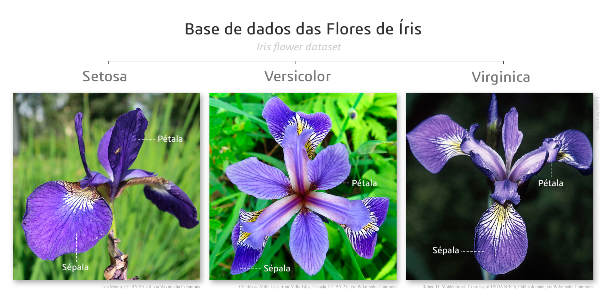
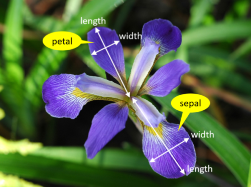

class: title-slide, center, middle
background-image: url(fig/slide-title/LMFTCA.png), url(fig/slide-title/ufpa.png), url(fig/slide-title/capa2.png)
background-position: 90% 90%, 10% 90%
background-size: 150px, 150px, cover

```{r setup, include=FALSE}
knitr::opts_chunk$set(
  fig.showtext = TRUE,
  fig.align = "center", 
  cache = FALSE,
  error = FALSE,
  message = FALSE, 
  warning = FALSE, 
  collapse = TRUE ,
  dpi = 600)
```

```{css, echo=FALSE}
.with-logo::before {
	content: '';
	width: 120px;
	height: 120px;
	position: absolute;
	bottom: 1.3em;
	right: -0.5em;
	background-size: contain;
	background-repeat: no-repeat;
}

.logo-ufpa::before {
	background-image: url(fig/slide-title/ufpa.png);
}

.logo-dplyr::before {
	background-image: url(https://github.com/rstudio/hex-stickers/raw/master/PNG/dplyr.png);
}

.logo-purrr::before {
	background-image: url(https://github.com/rstudio/hex-stickers/raw/master/PNG/purrr.png);
}

.logo-plumber::before {
	background-image: url(https://github.com/rstudio/hex-stickers/raw/master/PNG/plumber.png);
}
```

```{r packages, include=FALSE}
# remotes::install_github("dill/emoGG")
library(ggplot2)
library(dplyr)
library(ggimage)
library(kableExtra)
```

```{r xaringan-logo, echo=FALSE}
library(xaringanExtra)
use_logo(
  image_url = "fig/slide-title/LMFTCA.png",
  position = css_position(top = "1em", right = ".5em"),
  width = "130px",
  height = "130px")

use_scribble() # para escrever nos slides
use_share_again()
use_progress_bar()
#use_animate_all(style = c("slide_down"))

use_extra_styles(
  hover_code_line = TRUE,         #<<
  mute_unhighlighted_code = TRUE  #<<
)
xaringanExtra::use_editable(expires = 1)
#.can-edit[Você pode editar este título de slide]
#.can-edit.key-firstSlideTitle[Change this title and then reload the page]
use_clipboard()
```

```{r icon, echo=FALSE}
#remotes::install_github("mitchelloharawild/icons")
#remotes::install_github('emitanaka/anicon')
#library(icons)
#download_fontawesome()
#download_simple_icons()
```


<!-- title-slide -->
### Estatística Básica <br> (FL03017-EB)

## ᨒ <br>   `r anicon::faa("pagelines", animate="horizontal", colour="green")` Introdução à Linguagem R `r anicon::faa("pagelines", animate="horizontal", colour="green")` <br> 🍃 .font70[.brand-green[(AED - Iris Flower)]] 🍃  <br> ᨒ

##### 〰〰〰〰〰〰🌱〰〰〰〰〰〰
##### ᨒ
##### .font120[**Prof. Dr. Deivison Venicio Souza**]
##### Universidade Federal do Pará (UFPA)
##### Faculdade de Engenharia Florestal
##### Laboratório de Manejo Florestal, Tecnologias e Comunidades Amazônicas
##### E-mail: deivisonvs@ufpa.br
<br>
##### 1ª versão: 16/abril/2021 <br> (Atualizado em: `r format(Sys.Date(),"%d/%B/%Y")`) <br> Altamira, Pará

---
layout: true
class: with-logo logo-ufpa
<div class="my-header"></div>
<div class="my-footer"><span>Prof. Dr. Deivison Venicio Souza (E-mail: deivisonvs@ufpa.br)&emsp;&emsp;&emsp;&emsp;&emsp; <div3>Estatística Básica (FL03017-EB)</div3>/ <div2>Introdução à Linguagem R: Mecanismos de Indexação</div2> </div>

---

## Objetivos
<br><br>
Ao final desta aula espera-se que os discentes sejam capazes de:

* Compreender o conceito de indexação em estruturas de dados na linguagem R; 
* Compreender os principais mecanismos de indexação utilizados; e
* Diferenciar e aplicar a indexação para extração e substituição de elementos em diferentes estruturas de dados.

---

## Conteúdo

.pull-left-4[
**Mecanismos de Indexação no R**

[1 - Como fazer indexação no R?](#Ind)

[2 - Indexação de vetores](#IndV)

[3 - Indexação de matrizes](#IndM)

[4 - Indexação de arrays](#iae)

[5 - Indexação de data frames](#IndDF)

[6 - Indexação de listas](#IndL)
]

---
layout: false
name: conc
class: inverse, middle, center
background-image: url(fig/class0/sec.png)
background-size: cover

.font200[**Introdução à Linguagem R] <br> 
.font150[.blue[(Iris Flower - Fisher, 1936)]**]

---
layout: true
<div class="my-header"></div>
<div class="my-footer"><span>Prof. Dr. Deivison Venicio Souza (E-mail: deivisonvs@ufpa.br)&emsp;&emsp;&emsp;&emsp;&emsp;Estatística Básica (FL03017-EB) - Introdução à Linguagem R: Iris Flower</div>

---

## Iris Flower
<br>
Os conjuntos de dados estão disponíveis no [UCI-Machine Learning Repository](https://archive.ics.uci.edu/ml/index.php).

.shadow3[
## .center[.brown[Iris Flower]]
- O estudo intitulado "*The Use of Multiple Measurements in Taxonomic Problems*" (Fisher, 1936) foi o primeiro a usar o conjunto de dados .green[**Iris**].
- **Estrutura do conjunto de dados:** <br>
a) 150 amostras <br>
b) 3 espécies: Setosa, Versicolor e Virginica (50 amostras de cada) <br>
c) 5 atributos (variáveis): (Sepal Length, Sepal Width, Petal Length, Petal Width, Species)
]

---

## Iris Flower
<br>

```{r, echo=FALSE, out.width='80%', fig.align='center', fig.cap='', dpi=600}

```
.center[.font70[**Fonte**: [pt.wikipedia.org](https://pt.wikipedia.org/wiki/Conjunto_de_dados_flor_Iris)]]

---

## Iris Flower
<br>

```{r, echo=FALSE, out.width='45%', fig.align='center', fig.cap='', dpi=600}

```

.center[.font70[**Fonte**: [https://www.integratedots.com](https://www.integratedots.com/determine-number-of-iris-species-with-k-means/)]]

---

## Iris Flower

### 1º Passo: Carregar e visualizar o dataset

.pull-left-14[
```{r iris, echo=T, eval=F}
# Conjunto de dados
data(iris)
```

```{r iris1, echo=T, eval=F}
# Imprime 6 primeiras linhas
head(iris)
```

```{r iris2, echo=T, eval=F}
# Imprime 6 últimas linhas
tail(iris)
```
]

.pull-right-13[
```{r ref.label="iris1", echo=FALSE, eval=TRUE, collapse=T}
```

```{r ref.label="iris2", echo=FALSE, eval=TRUE, collapse=T}
```
.font80[Obs.: O conjunto de dados *Iris Flower* está disponível no R-base. **Basta carregá-lo**!]
]

---

## Iris Flower

### 2º Passo: Avaliar a estrutura do dataset

.pull-left-14[
```{r iris3, echo=T, eval=F}
# Estrutura do conjunto de dados
str(iris)
```

```{r iris4, echo=T, eval=F}
# Nome das variáveis
names(iris)
```

```{r iris5, echo=T, eval=F}
# Dimensão do dataset
dim(iris)
```

]

.pull-right-13[
```{r ref.label="iris3", echo=FALSE, eval=TRUE, collapse=T}
```

```{r ref.label="iris4", echo=FALSE, eval=TRUE, collapse=T}
```

```{r ref.label="iris5", echo=FALSE, eval=TRUE, collapse=T}
```

]

---

## Iris Flower

### 3º Passo: Obter um sumário estatístico do dataset

.pull-left-14[
```{r iris6, echo=T, eval=F}
# Estrutura do conjunto de dados
summary(iris)
```

.font80[
⚠️ **Limitação**: A função summary() fornece um resumo estatístico dos dados, porém se restringe principalmente às medidas de tendência central e de posição.
]
]

.pull-right-13[
```{r ref.label="iris6", echo=FALSE, eval=TRUE, collapse=T}
```
]


---

## Iris Flower

### 3º Passo: Alternativamente, pode-se usar funções específicas...
<br>
📊 **Medidas de tendência central (ou posição)**
<br>

- Utilize funções específicas do R para calcular cada medida:

**Média** (valor médio dos dados) → <span style="color:#1f77b4;"><b>`mean()`</b></span>

**Mediana** (valor central) → <span style="color:#1f77b4;"><b>`median()`</b></span>

**Moda** (valor mais frequente) → <span style="color:#1f77b4;"><b>`table()`</b></span> + <span style="color:#1f77b4;"><b>`which.max()`</b></span>

**Quartis (Q1, Q2, Q3)** (dividem os dados ordenados em 4 partes) → <span style="color:#1f77b4;"><b>`quantile()`</b></span>

---

## Iris Flower

### 3º Passo: Alternativamente, pode-se usar funções específicas...
<br>
📊 **Medidas de tendência central (ou posição)**
<br>

.pull-left-4[
```{r iris7, echo=T, eval=F}
# Define a variável de interesse
x <- iris$Sepal.Length

# Medidas de tendência central
mean(x)                                   # Média
median(x)                                 # Mediana
names(table(x))[which.max(table(x))]      # Moda
quantile(x, probs = c(0.25, 0.50, 0.75))  # Quartis
```
<br>

👉 .font80[**Aplique essas funções para as demais variáveis quantitativas do dataset. Interprete os resultados!**]

]

.pull-right-4[
```{r ref.label="iris7", echo=FALSE, eval=TRUE, collapse=T}
```
]

---

## Iris Flower

### 3º Passo: Alternativamente, pode-se usar funções específicas...
<br>
📊 **Medidas de dispersão (ou variabilidade)**
<br>

.pull-left-4[
```{r iris8, echo=T, eval=F}
# Define a variável de interesse
x <- iris$Sepal.Length

# Medidas de dispersão
min(x)                            # Mínimo
max(x)                            # Máximo
max(x) - min(x)                   # Amplitude Total
var(x)                            # variabilidade dos dados em torno da média
sd(x)                             # dispersão média dos dados em torno da média
IQR(x)                            # intervalo interquartílico (Q3 - Q1)
(cv <- (sd(x) / mean(x)) * 100)   # coeficiente de variação, em %
```

👉 .font80[**Aplique essas funções para as demais variáveis quantitativas do dataset. Interprete os resultados!**]

]

.pull-right-4[
```{r ref.label="iris8", echo=FALSE, eval=TRUE, collapse=T}
```
]

---

## Iris Flower

### 4º Passo: Interpretação — Sepal.Length (iris)...
<br>

📍 **Medidas de tendência central (ou posição)**
- Média (~5,84 cm): representa o valor médio do comprimento das sépalas
- Mediana (~5,80 cm): valor central dos dados, divide em duas parte iguais (muito próximo da média)
- Q1 (~5,10 cm) → 25% dos dados estão abaixo desse valor
- Q2 (~5,80 cm) → mediana
- Q3 (~6,40 cm) → 75% dos dados estão abaixo desse valor

---

## Iris Flower

### 4º Passo: Interpretação — Sepal.Length (iris)...
<br>

📊 **Medidas de dispersão (ou variabilidade)**
- Mínimo e Máximo (4,3 a 7,9 cm): mostram a variação total dos dados
- Amplitude Total (~3,6 cm): diferença entre o menor e o maior valor
- Desvio-padrão (~0,83 cm): valores estão, em média, a 0,83 cm da média
- Variância (~0,69 cm²): confirma a variabilidade dos dados
- IQR (~1,3 cm): representa a variação dos 50% dados centrais (entre Q1 e Q3)
- Coeficiente de Variação (~14%): indica variabilidade moderada

---

## Iris Flower

### 5º Passo: Visualização gráfica — Sepal.Length (iris)...

📊 **Histograma (distribuição dos dados)**

.pull-left-4[
```{r iris9, echo=T, eval=F}
# Carregar pacote
library(ggplot2)

# Histograma simples
ggplot(iris, aes(x = Sepal.Length)) +
  geom_histogram(fill = "lightblue",
                 color = "black",
                 binwidth = 0.5,               # largura das classes
                 boundary = 0) +               # ponto de início das classes
  labs(title = "Histograma de frequência",
       x = "Sepal Length (cm)",
       y = "Frequência") +
  theme_bw()
```

]

.pull-right-4[
```{r ref.label="iris9", echo=FALSE, eval=TRUE, collapse=T, fig.width=4, fig.height=3}
```
]

---

## Iris Flower

### 5º Passo: Visualização gráfica — Sepal.Length (iris)...

📊 **BoxPlot (Univariado)**

.pull-left-4[
```{r iris10, echo=T, eval=F}

# Boxplot simples
ggplot(iris, aes(y = Sepal.Length)) +
  geom_boxplot(fill = "lightgreen",
               color = "black") +
  labs(title = "Boxplot",
       y = "Sepal Length (cm)") +
  theme_bw()
```

]

.pull-right-4[
```{r ref.label="iris10", echo=FALSE, eval=TRUE, collapse=T, fig.width=4, fig.height=3}
```
]

---

## Iris Flower

### 5º Passo: Visualização gráfica — Sepal.Length (iris)...

📊 **BoxPlot (Univariado) - com média destacada**

.pull-left-4[
```{r iris11, echo=T, eval=F}
# BoxPlot - com média destacada

ggplot(iris, aes(x = "", y = Sepal.Length)) +
  geom_boxplot(fill = "lightgreen",
               color = "black") +
  stat_summary(fun = mean,
               geom = "point",
               shape = 18,
               size = 3,
               color = "red") +
  labs(title = "Boxplot - com média destacada",
       x = "",
       y = "Sepal Length (cm)") +
  theme_bw()
```

]

.pull-right-4[
```{r ref.label="iris11", echo=FALSE, eval=TRUE, collapse=T, fig.width=4, fig.height=3}
```
]

---

## Iris Flower

### 5º Passo: Visualização gráfica — Sepal.Length (iris)...

📊 **Dot Plot**

.pull-left-4[
```{r iris12, echo=T, eval=F}
# Dot plot
ggplot(iris, aes(x = Sepal.Length)) +
  geom_dotplot(fill = "lightblue",
               color = "black",
               dotsize = 0.7) +
  labs(title = "Dot Plot - Sepal Length",
       x = "Sepal Length (cm)",
       y = "Frequência") +
  theme_bw()
```

]

.pull-right-4[
```{r ref.label="iris12", echo=FALSE, eval=TRUE, collapse=T, fig.width=4, fig.height=3}
```
]


<!--Slide XX -->
---
layout: false
name: etim
class: inverse, middle, center
background-image: url(fig/class0/sec.png)
background-size: cover

## .font200[Obrigado!]

```{r, echo=FALSE, out.width='20%', fig.align='center', fig.cap='', dpi=600}
knitr::include_graphics('fig/slide-title/LMFTCA.png')
```

👨🏻‍👩🏻‍👦🏻‍👦🏻 [@lmftca_ufpa](https://www.instagram.com/lmftca_ufpa/)

🌎 [https://www.lmftca.com.br/](https://www.lmftca.com.br/)

