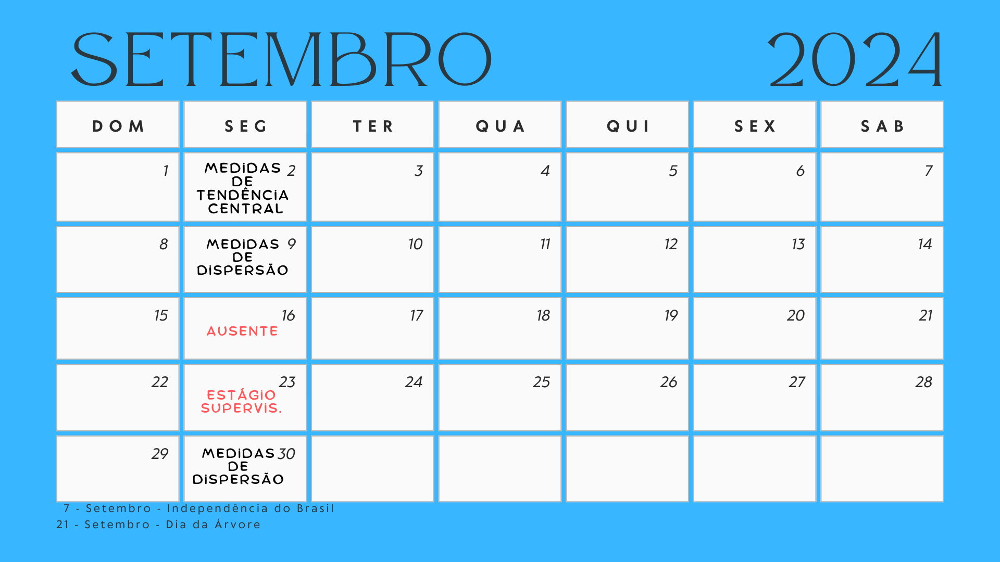
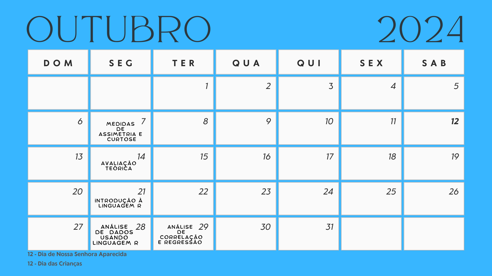

class: title-slide, center, middle
background-image: url(fig/slide-title/ufpa2.png), url(fig/slide-title/forest.png), url(fig/slide-title/img3.png)
background-position: 84% 90%, 95% 90%
background-size: 220px, 90px, cover

```{r setup, include=FALSE}
knitr::opts_chunk$set(
  fig.showtext = TRUE,
  fig.align = "center", 
  cache = TRUE,
  error = FALSE,
  message = FALSE, 
  warning = FALSE, 
  collapse = TRUE ,
  dpi = 600)
```

```{r xaringan-logo, echo=FALSE}
library(xaringanExtra)
use_logo(
  image_url = "fig/slide-title/ufpa.png",
  position = css_position(top = ".8em", right = "-.5em"),
  width = "140px",
  height = "140px"
)
```

```{r icon, echo=FALSE}
#remotes::install_github("mitchelloharawild/icons")
#library(icons)
#download_fontawesome()
#download_simple_icons()
```

```{r, echo=FALSE}
#remotes::install_github("jhelvy/xaringanBuilder")
#library(xaringanBuilder)
#build_pdf("Aula0-Cronograma.Rmd")
#pagedown::chrome_print("Slides/Aula0-Cronograma.html",output="test.pdf")
```

<!-- title-slide -->
# Estatística Básica <br> (FL03017-EB)
<br><br>
## `r anicon::faa("pagelines", animate="horizontal", colour="green")` Cronograma da disciplina `r anicon::faa("pagelines", animate="horizontal", colour="green")`

#### **Prof. Dr. Deivison Venicio Souza**
##### Universidade Federal do Pará (UFPA) 
##### Faculdade de Engenharia Florestal
##### E-mail: deivisonvs@ufpa.br
<br>
##### 1ª versão: 30/julho/2021 <br> (Atualizado em: `r format(Sys.Date(),"%d/%B/%Y")`) <br> Altamira, Pará

---
layout: true
<div class="my-header"></div>
<div class="my-footer"><span>Prof. Dr. Deivison Venicio Souza (E-mail: deivisonvs@ufpa.br)&emsp;&emsp;&emsp;&emsp;&emsp;Estatística Básica (FL03017-EB) - Cronograma da disciplina</div>

---

## 👋 Olá, sejam bem vindos!

### **Sobre o facilitador**
.pull-left[

1. .green[Graduação (Titulação: ano 2008)]
    - Universidade Federal Rural da Amazônia (UFRA); e
    - Título: Bacharel em Engenharia Florestal.

2. .green[Mestrado (Titulação: ano 2011)]
    - Universidade Federal Rural da Amazônia (UFRA);
    - Programa de Pós-graduação em Ciências Florestais (PPGCF); e
    - Área de Concentração: Manejo de ecossistemas florestais.
]

.pull-right[

3. .green[Doutorado (Titulação: ano 2020)]
    - Universidade Federal do Paraná (UFPR);
    - Programa de Pós-graduação em Engenharia Florestal (PPGEF); e
    - Área de Concentração: Manejo Florestal.
    
4. .green[Especialização (Defesa: ano 2019)]
    - Universidade Federal do Paraná (UFPR);
    - Área: Big Data e Data Science
]

---

## 👋 Olá, sejam bem vindos!

.pull-left[
### **Interesses atuais**
1. .green[Linguagem de programação]
    - R
    - Python

2. .green[Modelagem preditiva aplicada à ciência florestal]
    - Aprendizado de máquina
    
3. .green[Visão computacional]
    - reconhecimento de imagens
    
4. .green[Criação de Dashboard - Shiny]
]

.pull-right[
### **Websites e contatos**

`r icons::simple_icons("github")` GitHub: https://github.com/DeivisonSouza

<span class="iconify" data-icon="fa-brands:orcid" data-inline="false"></span>


<div itemscope itemtype="https://schema.org/Person"><a itemprop="sameAs" content="https://orcid.org/0000-0002-2975-0927" href="https://orcid.org/0000-0002-2975-0927" target="orcid.widget" rel="me noopener noreferrer" style="vertical-align:top;">https://orcid.org/0000-0002-2975-0927</a></div>

```{r, echo=FALSE, out.width='20%', fig.align='center', fig.cap=''}

```

Email: deivisonvs@ufpa.br
]

<!-- Slide 2 -->
---
## Cronograma .black[.font80[(**Horário: 07h30min - 12h30min**)]]
<br>

```{r, echo = FALSE, out.width='80%', fig.align='center', fig.cap='', dpi=600}

```

<!-- Slide 3 -->
---
## Cronograma .black[.font80[(**Horário: 07h30min - 12h30min**)]]
<br>

```{r, echo = FALSE, out.width='80%', fig.align='center', fig.cap='', dpi=600}

```

<!-- Slide 3 -->
---
## Cronograma .black[.font80[(**Horário: 07h30min - 12h30min**)]]
<br>

```{r, echo = FALSE, out.width='80%', fig.align='center', fig.cap='', dpi=600}

```

<!-- Slide 4 -->
---

## Ementa da disciplina (FL03017-EB)

.shadow2[
<br>
1 - Introdução à estatística básica; 

2 - Distibuição de frequências;

3 - Medidas de tendência central (ou posição); 

4 - Medidas de dispersão (ou variabilidade); 

5 - Medidas de assimetria e curtose;

6 - Testes de comparação de médias;

7 - Análise de correlação linear simples;

8 - Análise de regressão linear simples e múltipla; e

9 - Introdução à linguagem R para análise de dados.

]

<!-- Slide 7 -->
---

## Estratégias e Ferramentas de Ensino
<br>

- **Aula Presencial** (*Sala a definir*)

Aulas teóricas e práticas presenciais, realização de atividades complementares e avaliações de desempenho.

--

- **Sala de aula virtual** (*Sigaa*)

Comunicação, envio de atividades complementares e de conteúdos digitas.

--
<br><br>

- **Repositório GitHub**

Repositório com os slides em .html, arquivos .R e .Rmd, figuras, conjunto de dados (e outros). O repositório pode ser acessado em: [FL03017-Estatística-Básica](https://github.com/DeivisonSouza/FL03017-Estatistica-Basica)

<!-- Slide 8 -->
---
## Estratégias de avaliação da aprendizagem
<br>

- **Atividades práticas**

Exercícios com dados reais (quando possível) para aprendizado da matemática e estatísticas inerentes aos conteúdos abordados;
<br><br>

Introdução ao uso da Linguagem de Programação R e bibliotecas para análise de dados reais.

---
## Estratégias de avaliação da aprendizagem
<br>

- **Avaliação teórica**

Avaliações teóricas presenciais.

--
<br><br>

- **Participação** 

.red[**Atenção**]`r anicon::faa("exclamation-triangle", colour="red")`: O nível de participação e interação nas aulas presenciais poderá ser critério para definir uma pontuação extra nas avaliações teóricas.

<!-- Slide 9 -->
---
## Média Final e Conceito

$$
\Large
MF = \frac{(NA*2)+NPT}{3}
$$

**MF** = Média Final

**NA** = Nota das Atividade (Soma das atividades será 10 pts.)

**NPT** = Nota das Provas Teóricas (Soma das provas será 10 pts.)

<br>

| Conceito     | Intervalo      |
|--------------|----------------|
| Excelente    | 9,0 ≤ MF ≤ 10    |
| Bom          | 7,0 ≤ MF ≤ 8,9   |
| Regular      | 5,0 ≤ MF ≤ 6,9 |
| Insuficiente | 0 ≤ MF ≤ 4,9   |


<!-- Slide 10 -->
---
## Plano de Ensino
<br><br>

O plano de ensino da disciplina pode ser acessado em:

[Plano de Ensino (FL03017)](https://github.com/DeivisonSouza/FL03034-EF/blob/master/Slides/PE/EF-PE.pdf)

<!-- Slide 11 -->
---
## Reprovação `r anicon::faa("exclamation-triangle", colour="red")`
<br>
Conforme o Regimento Geral da UFPA, será considerado reprovado o discente que:

- Obtiver o conceito Insuficiente (INS), isto é, nota inferior a 5 (cinco); (.green[**Aplicável**])
- Sem Avaliação (SA); ou (.green[**Aplicável**])
- Não obtiver a frequência mínima de 75% na disciplina, isto é, Sem Frequência (SF). (.green[**Aplicável**])

<!-- Slide 12 -->
---
## Normativas da UFPA

- [Regimento geral da UFPA de 29/12/2006](chrome-extension://efaidnbmnnnibpcajpcglclefindmkaj/https://www.ufpa.br/images/docs/regimento_geral.pdf)

Disciplina os aspectos gerais e comuns da estruturação e do funcionamento dos órgãos e serviços da Universidade Federal do Pará (UFPA), cujo Estatuto regulamenta. 

- [Resolução n. 4.399, de 14 de maio de 2013](chrome-extension://efaidnbmnnnibpcajpcglclefindmkaj/http://www.proeg.ufpa.br/images/Artigos/Academico/Downloads/Regulamento_de_Graduacao.pdf)

Aprova o Regulamento do Ensino de Graduação da Universidade Federal do Pará.


- [Resolução n. 5.686, de 26 de outubro de 2023](https://sege.ufpa.br/boletim_interno/downloads/resolucoes/consepe/2023/5686%20Calend%C3%A1rio%20Acad%C3%AAmico%20da%20UFPA%20-%202024.pdf)

Aprova o Calendário Acadêmico da Universidade Federal do Pará (UFPA), para o ano de 2024.

<!-- Slide 13 -->
---
## Bibliografia básica

<br><br>
FERREIRA, D. F. Estatística básica. 2 ed. rev. Lavras: Ed. UFLA, 2009. 664 p.
<br><br>
KAZMIER, L. J. Estatística aplicada à economia e administração. São Paulo: Pearson Makron Books, 1982. (Coleção Schaum)
<br><br>
MORETTIN, P. A.; BUSSAB, W. O. Estatística básica. Saraiva Educação SA, 2017.

---

## Morettin e Bussab (2017)
<br>

.pull-left-4[
**Livro com códigos em R na internet**
<br><br>

Morettin, Pedro Alberto; Bussab, Wilton Oliveira. **Estatística básica**. 9 ed., São Paulo: Saraiva, 2017, 554p.
<br><br>

Dados, códigos R (e outros) podem ser acessados em:

**Link**: <a href="https://www.ime.usp.br/~pam/EstBas.html">Estatística básica</a>

]

.pull-right-4[
```{r, echo=FALSE, out.width='60%', fig.align='center', fig.cap='', dpi=600}
knitr::include_graphics('fig/slide-title/Livro-Bussab.jpeg')
```
]


<!-- Slide 14 -->
---
## Bibliografia complementar

<br><br>
VIEIRA, S. Bioestatística: tópicos avançados. 3 ed. Rio de Janeiro: Elsevier, 2010. 278p.
<br><br>
VIEIRA, S. Estatística básica. São Paulo: Cengage Learning, 2012. 176p.


